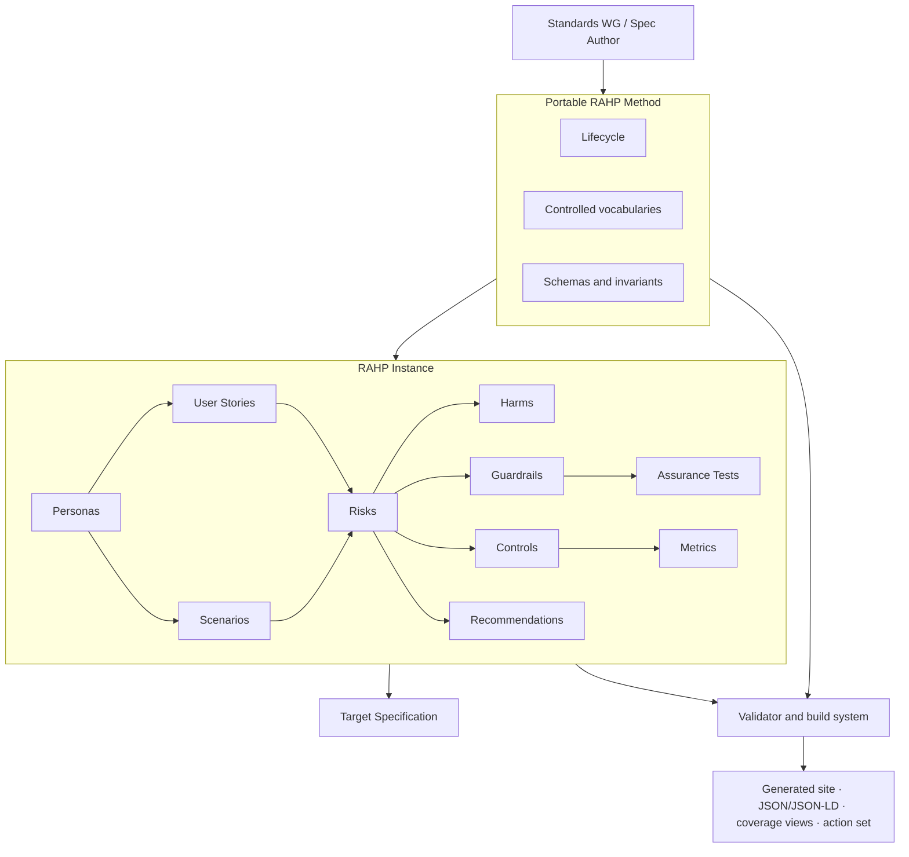

# DTG RAHP Toolkit

**Risk Assessment & Harms Prevention Task Force · Decentralised Trust Graph Working Group**  
Working Draft · toolkit v0.3-dev · CC-BY 4.0

RAHP is a repeatable assurance method for pressure-testing standards against risks and human harms, tracing findings to controls and evidence, and feeding actionable changes back into specification development. This repository contains both the **portable RAHP method** and a **DTG-specific worked instance**.

## What do you want to do?

| Goal | Start here |
|---|---|
| Review a specification for risks and harms | [Pressure-testing a specification](docs/pressure-testing-a-spec.md) |
| Exercise a specification against scenario corpora | [Scenario-driven pressure testing](docs/scenario-driven-pressure-testing.md) |
| Perform an adversarial protocol/security review | [Security and hardening review](docs/security-hardening-review.md) |
| Have an AI agent prepare and run the review workflow | [AI-agent pressure testing](docs/using-an-ai-agent.md) |
| Understand the RAHP method | [How RAHP works](docs/how-rahp-works.md) |
| Explore the DTG instance | [DTG instance](docs/index.md#explore-the-dtg-instance) |
| Adopt RAHP for another Working Group | [Adoption guide](ADOPTION.md) |
| Make a small first assessment | [Minimum viable RAHP](examples/minimal-instance/README.md) |
| Contribute risks, controls, or evidence | [Contributing](CONTRIBUTING.md) |
| Understand where a remediation belongs | [Governance boundaries](docs/governance-boundaries.md) |

## Operating model



The mental model is simple: **people and contexts surface scenarios; scenarios surface risks; risks drive controls and guardrails; guardrails become testable; findings feed back into specification development.**

## Repository architecture

| Path | Authority and editability |
|---|---|
| `method/` | Portable RAHP mechanics: lifecycle, controlled vocabularies, schemas. Change deliberately because adopters inherit it. |
| `data/` | Canonical DTG RAHP instance. This is the source of truth for risks, controls, personas, scenarios and related records. |
| `tools/` | Validation and build automation. Produces machine-verifiable evidence and generated views. |
| `context/` | JSON-LD context used by generated linked-data outputs. |
| `docs/` | Just the Docs source for understanding and applying RAHP; published through GitHub Pages. |
| `corpora/` | Domain scenario adapters used to exercise specifications against portable `SP-*` patterns. |
| `examples/` | Worked pressure tests and minimum viable adoption patterns. |
| `build/` | Generated output. Do not hand-edit. |
| `archive/` | Historical source artefacts and old generated views retained for provenance. Do not edit. |

See the [full repository map](docs/diagrams/repository-map.md) and [artefact relationship model](docs/diagrams/artefact-relationships.md).


## Scenario corpora

RAHP now includes four scenario adapters: DTG ZKP, Trust Tasks, DTG Core Credentials, and a composed Trust Tasks × Credential Spec corpus. The adapters provide **74 concrete scenario test vectors** while the reusable failure classes remain RAHP-owned `SP-*` patterns. See [Scenario corpora](docs/scenario-corpora.md), [Scenario coverage](docs/scenario-coverage.md), and [Cross-specification pressure testing](docs/cross-spec-pressure-testing.md).

## Documentation site

The repository is configured for a Just the Docs site deployed by GitHub Actions to GitHub Pages. The build/deploy workflow validates RAHP and all scenario corpora before publication. See [Publishing the RAHP site](docs/publishing.md) for the deployment pipeline and [GitHub Pages coverage](docs/pages-coverage.md) for what is rendered, including structured YAML/JSON projections at their repository paths.

## Quick start

```bash
pip install -r requirements.txt
python3 tools/validate.py
python3 tools/build.py
open build/site/index.html
```

`tools/validate.py` checks schema conformance, vocabularies, identifiers, references, symmetry, invariants, orphans and README counts. A clean exit is the minimum evidence that the instance is internally coherent.

## What is in the DTG instance

| Prefix | Type | Count |
|---|---|---|
| `RK-xx` | Risk | 43 risks |
| `CT-xx` | Control | 66 controls |
| `GR-xx` | Guardrail | 21 guardrails |
| `AT-xx` | Assurance test | 21 assurance tests |
| `M-xx` | Trust metric | 37 metrics |
| `US-xx` | User story | 36 user stories |
| `SC-xx` | Scenario | 33 scenarios |
| `EPIC-xx` | Capability cluster | 21 EPICs |
| `D/M/B/EC` | Persona | 16 personas |
| `REC-x` | Standards recommendation | 9 recommendations |
| `RA-xxx` | Risk acceptance | 3 risk acceptances (all `pending`) |
| `GP-xxx` | Governance precedent | 3 governance precedents |

These counts are checked by `tools/validate.py` and cannot silently drift.

## Three distinctions that matter

**Controls (`CT-xx`)** continuously reduce likelihood or impact. **Guardrails (`GR-xx`)** are hard-stop preconditions before progression. **Assurance tests (`AT-xx`)** are binary evidence that a guardrail has been satisfied.

`Critical` severity is not simply “very High”. It identifies a risk whose non-zero incidence is unacceptable. Critical risks carry no numeric score, must be gated by a guardrail, and may not be risk-accepted.

## Pressure-testing specifications

RAHP is more than a risk register. A specification review should create a traceable chain from target/version → affected personas/scenarios → triggered risks → controls/guardrails/evidence → finding disposition → standards action. Start with [the pressure-testing workflow](docs/pressure-testing-a-spec.md), then compare the [worked DTG Credential Specification example](examples/dtg-credential-spec/README.md) and the [Trust Tasks Framework example](examples/trust-tasks-spec/README.md). The two examples show both direct specification findings and findings deliberately routed to companion specifications, governance, runtime controls, and operational policy. The reusable starter is [`examples/pressure-test-template.yaml`](examples/pressure-test-template.yaml). `pressure-test.yaml` is the source of truth; `python3 tools/render_pressure_tests.py` renders its review metadata, finding index, evidence, harms, recommendations and retest triggers into the example README. Every cited RAHP artefact is rendered as an ID + title hyperlink to the generated [Reference catalogue](build/site/catalogue.html), where each canonical record has a stable deep-link anchor. `python3 tools/validate_pressure_tests.py` checks both the canonical RAHP references and that the rendered Markdown is current; `python3 tools/validate_reference_links.py` checks that generated deep links resolve.

A finding does **not** imply that every mitigation belongs in the reviewed specification. RAHP explicitly routes findings to the correct control plane: core specification, companion specification, governance, implementation guidance, runtime control, operational policy, formal risk acceptance, or no action when already addressed/out of scope.

For deeper adversarial review, RAHP provides a [security-hardening workflow](docs/security-hardening-review.md), a structured [external standards-alignment model](docs/standards-alignment.md), and coordinated worked reviews for [Trust Tasks](examples/security-hardening/trust-tasks/SECURITY_REVIEW.md), [DTG Core Credentials](examples/security-hardening/credential-spec/SECURITY_REVIEW.md), and their [cross-spec composition](examples/security-hardening/cross-spec/COMPOSITION_THREAT_MODEL.md). These records add exploitability, impact, detectability, propagation, attack preconditions, existing mitigations, residual gaps, control-plane routing and closure tests while retaining deep links to the canonical RAHP catalogue.

## Scenario-driven pressure testing

RAHP now supports reusable scenario patterns and domain-owned scenario corpora. `method/scenario-patterns.yaml` defines portable stress conditions such as malicious verifier, cross-party collusion, accessibility constraint, delegated-agent overreach, degraded operation, policy transition and cross-implementation ambiguity. `corpora/dtg-zkp.yaml` is the first reference adapter, mapping the 30 DTG ZKP pressure-test use cases to those patterns while preserving source ownership of `UC-*` identifiers. Findings can optionally trace `scenarios`, `scenario_patterns`, and `personas` before linking to risks, controls, guardrails and assurance tests. Validate adapters with `python3 tools/validate_scenario_corpora.py`.

The human documentation is published with **Just the Docs (JTD) on GitHub Pages**. The Pages workflow validates RAHP artefacts and scenario corpora, builds generated evidence views, builds the JTD site, checks internal rendered links, and deploys `_site`.

## Known method gaps

Known gaps remain machine-readable in `method/lifecycle.yaml`. The blocking gaps include the absence of a formal risk-acceptance authority model (`GAP-3.1`) and contribution/integration governance (`GAP-5.1`). They are visible rather than hidden because assurance requires knowing not only what is controlled, but also where authority and enforcement remain undefined.

## Generated site

The generated site remains the drill-down evidence surface. Its database-oriented pages are generated from canonical YAML; the human entry point is now the guided documentation in this repository. Run `python3 tools/build.py` after canonical data changes.

## Contributing

See [CONTRIBUTING.md](CONTRIBUTING.md). In short: edit canonical sources, preserve provenance, validate before review, and never hand-edit generated outputs.

---

*Maintained by the Risk Assessment & Harms Prevention Task Force, DTGWG.*  
*CC-BY 4.0 — reuse with attribution.*

## Unified review modes

The toolkit now exposes one review entry point:

```bash
python3 tools/review.py --help
```

A reviewer can scaffold and run a **RAHP pressure test**, a **security-hardening review**, or a **combined review** that preserves both analytical lenses and generates a cross-lens synthesis. See [`docs/review-modes.md`](docs/review-modes.md).

`tools/review.py` is an orchestration tool, not a static vulnerability scanner: the findings must be produced from examination of the target specification or document, while the repository tooling handles canonical records, rendering, validation, reference resolution, and combined reporting.
## Corpus synchronization

Scenario corpora are maintained as curated, versioned adapters rather than live mirrors. `corpora/sources.yaml` declares tracked source repositories, portfolio relationships and update policy; `tools/corpus_status.py` detects source drift; and the DTG Portfolio Monitor repository registry supplies portfolio-scope metadata without overriding corpus provenance. See [`docs/corpus-synchronization.md`](docs/corpus-synchronization.md).

