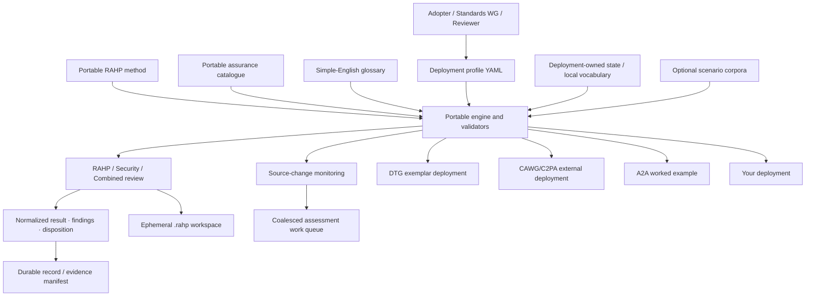

# RAHP Toolkit

**Risk Assessment & Harms Prevention**  
Release v1.1.0 · CC-BY 4.0

RAHP Toolkit is a **portable specification-assurance toolkit** for pressure-testing standards and technical specifications against human harms, risk, governance weaknesses, and adversarial or security failure conditions.

It combines a reusable assurance method with configuration-driven review tooling, scenario corpora, source-change monitoring, validation, and evidence generation. The portable method is independent of any one standards community or deployment.

> **Project identity:** RAHP Toolkit is the project. DTG and CAWG/C2PA are separately scoped deployments that use it. DTG is the historical origin and bundled exemplar. Neither deployment defines the portable method for another adopter.

## What RAHP produces

A RAHP assessment is intended to leave a traceable assurance chain:

```text
target + pinned revision
  → affected people and scenarios
  → harm and risk hypotheses
  → controls and guardrails
  → assurance tests and evidence
  → finding + disposition
  → recommendation at the correct control plane
  → observable retest trigger
```

RAHP does **not** assume every finding belongs in the specification being reviewed. A finding may route to a companion specification, governance framework, implementation guidance, runtime control, operational policy, formal risk acceptance, or no change when the concern is already addressed or out of scope.

## Current v1.1 assurance model

v1.1 separates the reusable method from deployment-owned assessment state.

The portable catalogue under `method/catalogue/` currently contains **149 reusable assurance patterns**:

| Prefix | Pattern type | Count |
|---|---|---:|
| `HRM-*` | Human-harm patterns | 24 |
| `RKP-*` | Risk patterns | 38 |
| `CTP-*` | Control patterns | 31 |
| `GRP-*` | Guardrail patterns | 22 |
| `ATP-*` | Assurance-test patterns | 19 |
| `EVP-*` | Evidence patterns | 15 |

All portable risks have controls, all controls map to assurance patterns, and all risks that **require** a guardrail have one. `RKP-PE-02` remains explicitly conditional because failure-cost externalization needs a guardrail only where materially affected parties lack meaningful choice, exit, or remedy.

RAHP also includes a governed **56-term simple-English glossary** under `method/glossary/`. Structured YAML is authoritative; Markdown, JSON, JSON-LD, and generated site views are derived outputs.

See [Assurance knowledge model](docs/assurance-knowledge-model.md), [portable catalogue](docs/portable-assurance-catalogue.md), [Glossary](docs/glossary.md), and [v1.1.0 release notes](docs/releases/v1.1.0.md).

## Start here

| Goal | Start here |
|---|---|
| Understand the method | [How RAHP works](docs/how-rahp-works.md) and [Concepts](docs/concepts.md) |
| Understand RAHP terminology | [Glossary](docs/glossary.md) |
| Browse portable assurance patterns | [Portable assurance catalogue](method/catalogue/) and [catalogue guide](docs/portable-assurance-catalogue.md) |
| Inspect generated assurance coverage | [Portable catalogue view](build/site/portable-catalogue.html) and [assurance graph](build/site/assurance-graph.html) |
| Configure your own repositories | [Configuration-driven adoption](docs/configuration.md) and [Adopting RAHP](ADOPTION.md) |
| Run a risks-and-harms review | [Pressure-testing a specification](docs/pressure-testing-a-spec.md) |
| Run a security/adversarial review | [Security and hardening review](docs/security-hardening-review.md) |
| Run both lenses together | [Review modes](docs/review-modes.md) |
| Exercise scenario stress conditions | [Scenario corpora browser](corpora/) and [Scenario-driven pressure testing](docs/scenario-driven-pressure-testing.md) |
| Understand portability and deployment boundaries | [Portability](docs/portability.md) |
| Understand the stable engine boundary | [Engine contract](docs/engine-contract.md) |
| Contribute to RAHP | [How to contribute](docs/how-to-contribute.md) |
| Inspect current example HEAD qualification | [v1.1 HEAD qualification](docs/head-qualification.md) |

## Quick start

Install the Python dependencies and validate the minimal portable configuration:

```bash
pip install -r requirements.txt
python3 tools/rahp.py config-validate --config examples/configurations/minimal.yaml
python3 tools/rahp.py targets --config examples/configurations/minimal.yaml
python3 tools/validate_portability.py
```

Run the unified review entry point:

```bash
python3 tools/review.py --help
```

A reviewer may run `rahp`, `security`, or `combined` mode. The tooling scaffolds, validates, and renders review evidence; it does not replace the human judgement needed to produce defensible findings.

To validate the repository and generated assurance evidence:

```bash
python3 tools/validate.py
python3 tools/validate_catalogue.py
python3 tools/validate_glossary.py
python3 tools/validate_pressure_tests.py
python3 tools/validate_security_reviews.py
python3 tools/validate_combined_reviews.py
python3 tools/build.py
python3 tools/validate_reference_links.py
```

## Current architecture



The portability invariant is **shared method and engine contract, independent deployment context**. The stable `rahp-engine-contract-v1` boundary remains language-neutral. Independent Python and TypeScript implementations are required to agree on shared normalized-result and evidence-retention behaviours through conformance fixtures.

Normal run exhaust lives under ignored `.rahp/` workspaces. Git retains compact dispositions, evidence manifests, deployment state, and deliberately promoted examples rather than every generated review.

## Repository map

| Path | Role |
|---|---|
| `method/` | Portable lifecycle, catalogue, glossary, controlled vocabularies, schemas, and engine/configuration contracts. |
| `tools/` | Portable orchestration, validation, monitoring, rendering, and build tooling. |
| `profiles/<id>/` | Deployment configuration: repositories, branches, scope, context, and allowed review modes. |
| `instances/<id>/` | Deployment-owned state, review records, and optional local assurance vocabulary. |
| `corpora/` | Optional domain scenario adapters mapped to portable `SP-*` stress patterns. |
| `examples/` | Curated worked assessments and adoption fixtures. |
| `data/` | Bundled DTG exemplar catalogue retained for compatibility and deployment evidence; **not the portable RAHP method**. |
| `build/` | Generated evidence, machine-readable artefacts, and layered assurance-site views. Do not hand-edit generated outputs. |
| `docs/` | Guided documentation for adopters, reviewers, contributors, and bundled deployments. |
| `archive/` | Historical provenance only; not current authority. |

See the [repository map](docs/diagrams/repository-map.md) and [portability contract](docs/portability.md).

## Worked examples and deployment proof

RAHP includes several deliberately different examples to test portability and composition:

- **DTG exemplar:** the historical deployment with local `RK/CT/GR/AT` governance and assurance state. See [DTG instance](docs/dtg-instance.md).

The bundled DTG exemplar currently contains:

| Prefix | Type | Count |
|---|---|---:|
| `RK-xx` | Risk | 48 |
| `CT-xx` | Control | 73 |
| `GR-xx` | Guardrail | 25 |
| `AT-xx` | Assurance test | 25 |
| `M-xx` | Trust metric | 40 |
| `US-xx` | User story | 36 |
| `SC-xx` | Scenario | 33 |
| `EPIC-xx` | Capability cluster | 21 |
| `P/D/M/B/EC` | Persona | 22 |
| `REC-x` | Standards recommendation | 9 |
| `RA-xxx` | Risk acceptance | 3 |
| `GP-xxx` | Governance precedent | 3 |
| `RP-xxx` | Governance rule profile | 1 |
| `EV-xxx` | Evidence artefact | 5 |

These are **deployment-local records**, not the portable `HRM/RKP/CTP/GRP/ATP/EVP` method catalogue.
- **CAWG/C2PA deployment:** an independently scoped, branch-aware external deployment with its own local risk namespace and monitoring state. See [CAWG/C2PA instance](docs/cawg-instance.md).
- **A2A:** an agent-protocol worked pressure test focused on discovery, delegation, callback trust, secondary credentials, and action provenance. See [A2A worked example](docs/a2a-example.md).
- **Trust Tasks × DTG Credential Specification:** a first-class cross-specification assessment showing how individually reasonable components can still produce authority, lifecycle, privacy, replay, and redress failures when composed. See [Cross-spec pressure testing](docs/cross-spec-pressure-testing.md). The maintained DTG composition can also be invoked manually through GitHub Actions; the run publishes a durable RAHP issue for WG circulation and includes upstream-ready issue candidates without auto-filing normative changes.
- **W3C DID Resolution v1:** a pinned Candidate Recommendation pressure test separating evidence retrieval, authority, freshness, resolver privacy and dereferencing assurance. See [`examples/w3c-did-resolution-2026-cr/`](examples/w3c-did-resolution-2026-cr/README.md).
- **DID Resolution × UN/CEFACT GRID/GTR:** a maintained cross-specification example that keeps technical DID control separate from registrar authority and relying-party trust decisions. See [`examples/cross-spec/did-resolution-grid-gtr/`](examples/cross-spec/did-resolution-grid-gtr/README.md).

The current maintained example estate has also been qualified against the live HEAD of 11 represented repositories. See [v1.1 HEAD qualification](docs/head-qualification.md).

## Monitoring and reassessment

`tools/instance_monitor.py` provides reusable `repository@branch` source monitoring for static deployment profiles. Assessment identities remain repository-scoped on `main` and become branch-scoped for non-main targets, preventing independent assurance objects from being coalesced. Role-aware materiality profiles let implementations include source/tests while specifications emphasize normative/schema surfaces. `tools/issue_watch.py` provides an allow-listed early-warning channel for selected upstream architecture or governance issues. `tools/publish_assessment_issues.py` converts material observations into stable assessment work items, and `tools/reconcile_assessment_issues.py` can produce or explicitly apply an evidence-backed closure plan after every durable assessment associated with an issue is dispositioned.

A monitoring event means **the assessment baseline may be stale**. It does not mean the upstream specification is defective. A reviewer must inspect the change and decide whether RAHP, security, or combined evidence needs revision.

## AI-assisted use and accountability

AI systems may assist with corpus review, change analysis, scenario generation, cross-reference discovery, evidence organization, or drafting candidate findings. AI output is **not**, by itself, assurance evidence and does not become a durable RAHP finding without human review.

Where AI materially affects an assessment, the durable record should preserve enough provenance to show what assistance occurred and that a human reviewed the conclusion. RAHP does not require prompt histories, hidden reasoning, or unnecessary execution exhaust.

See [AI-assisted RAHP](docs/ai-assisted-process.md).

## Contribution model

Contributions should preserve layer authority:

- reusable method semantics belong in `method/`;
- deployment configuration belongs in `profiles/<id>/`;
- deployment state and local vocabulary belong in `instances/<id>/`;
- generated output belongs in `build/` only through the build tools.

The documentation provides sequential workflows for:

1. [extending harms, risks, controls, guardrails, assurance, or evidence patterns](docs/contributing-catalogue.md);
2. [adding a toolkit capability](docs/contributing-capability.md); and
3. [adding a specification pressure test](docs/contributing-pressure-test.md).

Start with [How to contribute](docs/how-to-contribute.md) and [CONTRIBUTING.md](CONTRIBUTING.md).

## Releases and compatibility

v1.1 extends the portable method with the assurance catalogue, governed glossary, guardrail applicability semantics, cross-spec examples, and generated assurance views while preserving these stable compatibility boundaries:

```text
rahp-engine-contract-v1
normalized result schema version 1
rahp-evidence-retention-v1
```

Release history is maintained in [CHANGELOG.md](CHANGELOG.md) and [release documentation](docs/releases/).

## License and provenance

RAHP Toolkit preserves its DTG origin as provenance while operating as a portable, independently reusable assurance toolkit.

**CC-BY 4.0 — reuse with attribution.**
