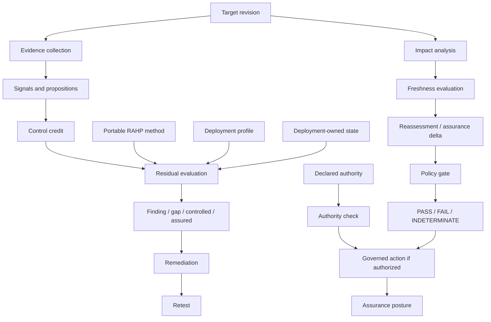

# RAHP Toolkit

**Risk Assessment & Harms Prevention**  
Release v1.2.0 (stable) · v1.5.0 release qualification candidate · CC-BY 4.0

RAHP Toolkit is a **portable specification-assurance toolkit** for pressure-testing standards, protocols, implementations and composed systems against human harms, governance failures, adversarial conditions and resilience risks.

> **Project identity:** RAHP Toolkit is the portable method and engine contract. DTG, CAWG/C2PA, OpenVTC, ARPA and other portfolios or projects are independently scoped deployments and examples. No deployment defines the portable method for another adopter. Real-world projects may demonstrate RAHP capabilities, but portable core contracts must remain usable by an unrelated specification, repository, service, dataset or governance process without inheriting project-specific semantics. The **Bundled DTG exemplar** remains part of project provenance and an exercised deployment, not a core dependency.

> **Release status:** v1.2.0 remains the stable published baseline. The accumulated v1.5.0 **Continuous Governed Assurance** work is now represented as a release-qualification candidate. `method/v1.5-release-qualification.yaml` and `tools/validate_v15_release.py` define the machine-verifiable cut-readiness gate. No v1.3.x or v1.4.x releases are planned. See [PROJECT-STATUS.yaml](PROJECT-STATUS.yaml), the [roadmap](ROADMAP.md), [assurance posture](docs/assurance-posture.md), and the [v1.5 release runbook](docs/v1.5-release-runbook.md).

## Stable v1.2 assurance model

RAHP v1.2 moved from signal-centric review to **evidence-driven assurance**. A detector signal is not automatically a finding. RAHP evaluates the relevant risk proposition against typed evidence, credited controls, assurance evidence and target context before assigning a residual assurance state.

The seven normalized residual states are:

| State | Meaning |
|---|---|
| `assured` | Required propositions are supported by sufficient evidence. |
| `controlled` | The risk exists, but effective controls and assurance evidence are present. |
| `finding` | Evidence supports an actionable residual defect. |
| `assurance-gap` | The control/property may exist, but evidence is incomplete. |
| `review-required` | Automation cannot safely determine the conclusion. |
| `not-assessed` | The proposition was not sufficiently evaluated. |
| `not-applicable` | The proposition is outside applicable scope. |

**Zero findings is not equivalent to assured.** A result can contain no confirmed findings while still carrying unresolved assurance gaps or review obligations.

See the [v1.2.0 release notes](docs/releases/v1.2.0.md), [assurance evaluation](docs/assurance-evaluation.md), [evidence classification](docs/evidence-classification.md), [interpreting results](docs/interpreting-results.md), and [remediation lifecycle](docs/remediation-lifecycle.md).

## Continuous Governed Assurance — v1.5 candidate

The v1.5 programme extends the evidence-driven baseline into a durable operational lifecycle:

```text
material target change
  → impact selection
  → freshness evaluation
  → evidence retained / weakened / invalidated
  → assessment or retest
  → assurance delta
  → residual obligation + remediation
  → policy gate: PASS | FAIL | INDETERMINATE
  → independent authority verification
  → governed disposition/publication
  → portable assurance posture
```

Implemented portable capabilities are:

- durable assessment and finding lineage;
- governed remediation and executable retest;
- assurance graph and deterministic impact analysis;
- evidence provenance, freshness and assurance delta;
- executable scoped authority and three-valued policy gates;
- portable assurance posture for operational/portfolio presentation;
- machine-verifiable v1.5 release qualification.

These are portable core contracts. Project-specific deployments test adoption but do not define the method.

## Portable assurance model

The reusable catalogue under `method/catalogue/` contains **162 assurance patterns**:

| Prefix | Pattern type | Count |
|---|---|---:|
| `HRM-*` | Human-harm patterns | 24 |
| `RKP-*` | Risk patterns | 43 |
| `CTP-*` | Control patterns | 35 |
| `GRP-*` | Guardrail patterns | 25 |
| `ATP-*` | Assurance-test patterns | 20 |
| `EVP-*` | Evidence patterns | 15 |

The catalogue is complemented by a governed simple-English glossary under `method/glossary/`. Structured method data is authoritative; Markdown, JSON, JSON-LD and rendered site views are publication surfaces.

## Start here

| Goal | Start here |
|---|---|
| Understand the method | [How RAHP works](docs/how-rahp-works.md) and [Concepts](docs/concepts.md) |
| Understand assurance conclusions | [Assurance evaluation](docs/assurance-evaluation.md) and [Interpreting results](docs/interpreting-results.md) |
| Understand evidence weight | [Evidence classification](docs/evidence-classification.md) |
| Understand durable reassessment history | [Assurance lineage](docs/assurance-lineage.md) |
| Govern remediation and evidence-based retesting | [Remediation and retesting](docs/remediation-lifecycle.md) |
| Select reassessments after material change | [Assurance graph and impact analysis](docs/assurance-graph-impact.md) |
| Track evidence provenance, freshness and change | [Evidence provenance and freshness](docs/evidence-freshness-delta.md) |
| Enforce scoped authority and release gates | [Authority and policy gates](docs/authority-policy-gates.md) |
| Render actionable current posture | [Assurance posture](docs/assurance-posture.md) |
| Qualify/cut v1.5.0 | [v1.5 release runbook](docs/v1.5-release-runbook.md) |
| Browse reusable assurance patterns | [Portable catalogue](method/catalogue/) and [catalogue guide](docs/portable-assurance-catalogue.md) |
| Run a risks-and-harms review | [Pressure-testing a specification](docs/pressure-testing-a-spec.md) |
| Run a security/adversarial review | [Security and hardening review](docs/security-hardening-review.md) |
| Run both lenses | [Review modes](docs/review-modes.md) |
| Run resilience analysis | [Distributed resilience and amplification](docs/distributed-resilience.md) |
| Test composed specifications | [Cross-spec pressure testing](docs/cross-spec-pressure-testing.md) |
| Configure another portfolio | [Configuration](docs/configuration.md) and [Adopting RAHP](ADOPTION.md) |
| Understand portability | [Portability](docs/portability.md) |
| Implement the engine contract | [Engine contract](docs/engine-contract.md) |
| Contribute | [How to contribute](docs/how-to-contribute.md) and [CONTRIBUTING.md](CONTRIBUTING.md) |

## Quick start

Install the Python dependencies and validate the portable configuration:

```bash
pip install -r requirements.txt
python3 tools/rahp.py config-validate --config examples/configurations/minimal.yaml
python3 tools/rahp.py targets --config examples/configurations/minimal.yaml
python3 tools/validate_portability.py
```

Run the unified review entry point:

```bash
python3 tools/review.py --help
```

Validate the repository and current v1.5 qualification surfaces:

```bash
python3 tools/validate.py
python3 tools/validate_catalogue.py
python3 tools/validate_glossary.py
python3 tools/validate_assurance_lineage.py
python3 tools/validate_remediation_retest_lineage.py
python3 tools/validate_assurance_graph.py
python3 tools/validate_evidence_freshness_delta.py
python3 tools/validate_authority_policy_gates.py
python3 tools/validate_capability_documentation.py
python3 tools/validate_v15_release.py
python3 tools/validate_engine_contract.py
python3 tools/build.py
python3 tools/validate_reference_links.py
```

Render the deployment-neutral operational posture fixture:

```bash
python3 tools/assurance_posture.py \
  --input examples/assurance-lineage/generic-posture-input.yaml \
  --generated-at 2026-08-22T00:00:00Z \
  --json
```

Build and exercise the TypeScript reference implementation:

```bash
npm install
npm run build:ts
npm run test:ts
```

## Current architecture



The portability invariant is **shared method and engine contract, independent deployment context**. `rahp-engine-contract-v1`, normalized result schema version `1`, and `rahp-evidence-retention-v1` remain the stable compatibility boundaries through the v1.5 release candidate.

## Operational posture, policy and authority

RAHP keeps assurance conclusion, freshness, remediation, policy and authority as distinct objects. Portfolio views expose those states directly rather than inventing an aggregate assurance percentage.

A policy gate can return `PASS`, `FAIL` or `INDETERMINATE`, but a gate result never creates authority. Portable authority grants bind actions such as `observe`, `assess`, `disposition`, `remediate`, `publish`, `accept-risk`, `close` and `reopen` to explicit scopes and lifecycle state.

Repository permissions do not automatically constitute governance authority. External publication, risk acceptance and closure require the applicable mandate.

## Documentation synchronization

`method/capability-documentation.yaml` is the machine-readable registry for v1.5 capability surfaces. It binds each capability to schemas, tools, tests, primary rendered documentation and required semantic terms. CI runs `tools/validate_capability_documentation.py`, making implementation/documentation drift a testable failure.

The registry is a synchronization control, not a replacement for review: structured method contracts remain authoritative and rendered documentation must accurately explain them.

## Repository map

| Path | Role |
|---|---|
| `method/` | Portable lifecycle, catalogue, schemas, glossary, mappings, qualification and engine/version contracts. |
| `tools/` | Portable orchestration, validation, monitoring, rendering, posture and build tooling. |
| `profiles/<id>/` | Deployment configuration and cross-specification registries. |
| `instances/<id>/` | Deployment-owned state, review records and local assurance vocabulary. |
| `corpora/` | Optional scenario adapters mapped to portable stress patterns. |
| `examples/` | Curated worked assessments and portability/conformance fixtures. |
| `packages/` | TypeScript schema/core/graph/CLI reference implementation. |
| `build/` | Generated evidence and publication views. Do not hand-edit generated outputs. |
| `docs/` | Guided documentation, release runbooks and release notes. |
| `archive/` | Historical provenance; not current authority. |

## Compatibility and releases

RAHP v1.2.0 remains the stable release until the v1.5.0 GitHub release is actually cut. Existing v1.1 and v1.2 normalized results remain valid. The stable boundaries are:

```text
rahp-engine-contract-v1
normalized result schema version 1
rahp-evidence-retention-v1
```

Breaking method or normalized-result changes follow `method/versioning.yaml` and require the corresponding major/schema transition rather than being introduced silently.

Release history is maintained in [CHANGELOG.md](CHANGELOG.md) and [release documentation](docs/releases/). From v1.5.x onward, release presentation metadata follows the [West Bengal butterfly naming policy](docs/release-naming.md); semantic versioning remains the compatibility authority. The butterfly is selected at random only when the release is otherwise ready to cut.

## AI-assisted use and accountability

AI systems may assist with review, change analysis, scenario generation, evidence organization and drafting. AI output is not, by itself, assurance evidence and does not become a durable finding without review. Durable records should preserve enough provenance to identify material assistance and the accountable human or governance disposition without requiring prompt histories or hidden reasoning.

See [AI-assisted RAHP](docs/ai-assisted-process.md).

## License and provenance

RAHP Toolkit preserves its DTG origin as provenance while operating as an independently reusable assurance toolkit.

**CC-BY 4.0 — reuse with attribution.**
