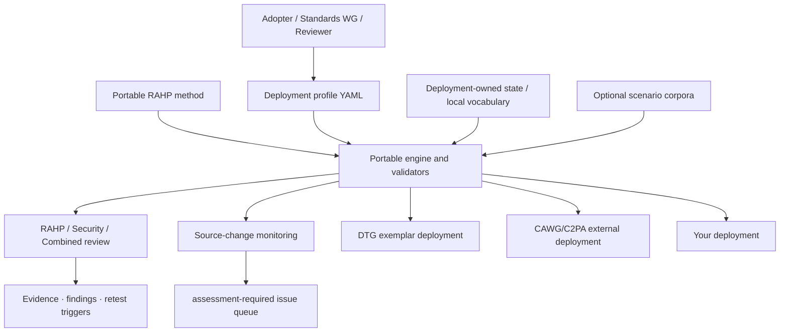

# RAHP Toolkit

**Risk Assessment & Harms Prevention**  
Release v0.6.0 · CC-BY 4.0

RAHP Toolkit is a **portable specification-assurance toolkit** for pressure-testing standards and technical specifications against risks, human harms, governance weaknesses and adversarial/security failure conditions. It provides a reusable method, configuration contract, review tooling, scenario patterns, source-change monitoring, validators and evidence rendering.

> **Project identity:** RAHP Toolkit is the project. DTG and CAWG/C2PA are separately scoped deployments that use it. DTG is the historical origin and bundled exemplar; CAWG/C2PA is the first substantial external deployment. Neither deployment defines the portable method for another adopter.

## Start here

| Goal | Start here |
|---|---|
| Understand the method | [How RAHP works](docs/how-rahp-works.md) and [Concepts](docs/concepts.md) |
| Configure your own repositories | [Configuration-driven adoption](docs/configuration.md) and [Adopting RAHP](ADOPTION.md) |
| Run a risks-and-harms review | [Pressure-testing a specification](docs/pressure-testing-a-spec.md) |
| Run a security/adversarial review | [Security and hardening review](docs/security-hardening-review.md) |
| Run both lenses together | [Review modes](docs/review-modes.md) |
| Exercise scenario stress conditions | [Scenario-driven pressure testing](docs/scenario-driven-pressure-testing.md) |
| Use AI assistance with human accountability | [AI-assisted RAHP](docs/ai-assisted-process.md) |
| Understand portability and deployment boundaries | [Portability](docs/portability.md) |
| Inspect the CAWG/C2PA external deployment | [CAWG/C2PA instance](docs/cawg-instance.md) |
| Inspect the bundled DTG exemplar | [DTG instance](docs/dtg-instance.md) |
| Read the v0.6 release | [v0.6.0 release notes](docs/releases/v0.6.0.md) |

## The v0.6 architecture



The portability invariant is **shared method and engine, independent deployment context**. A deployment may own its target repositories, branches, assessment vocabulary, monitoring state, review artefacts and governance decisions without importing another deployment's state.

## Repository architecture

| Path | Role |
|---|---|
| `method/` | Portable RAHP lifecycle, controlled vocabularies, schemas and configuration contract. |
| `tools/` | Portable orchestration, validation, monitoring, rendering and build tooling. |
| `profiles/<id>/` | Deployment configuration: repositories, branches, scope, context and allowed review modes. |
| `instances/<id>/` | Deployment-owned state, review records and optional local assurance vocabulary. |
| `corpora/` | Optional domain scenario adapters mapped to portable `SP-*` stress patterns. |
| `examples/` | Worked assessments and adoption fixtures. |
| `data/` | Bundled DTG exemplar catalogue retained for compatibility and generated evidence; **not the portable RAHP method**. |
| `build/` | Generated evidence and catalogue output. Do not hand-edit. |
| `docs/` | Guided documentation for the toolkit and bundled deployments. |
| `archive/` | Historical provenance only; not current authority. |

See the [repository map](docs/diagrams/repository-map.md) and [portability contract](docs/portability.md).

## Review model

A RAHP review should leave a traceable chain:

```text
target + pinned revision
  → affected people / scenarios
  → triggered deployment risk hypotheses
  → controls / guardrails / evidence
  → finding + disposition
  → recommendation at the correct control plane
  → observable retest trigger
```

RAHP does **not** assume every finding belongs in the specification being reviewed. A finding may route to a companion specification, governance framework, implementation guidance, runtime control, operational policy, formal risk acceptance, or no change when already addressed/out of scope.

The unified review entry point is:

```bash
python3 tools/review.py --help
```

A reviewer may run `rahp`, `security`, or `combined` mode. The tooling scaffolds, validates and renders review evidence; it does not replace the human judgement needed to produce defensible findings.

## v0.6 external deployment proof: CAWG/C2PA

v0.6 demonstrates portability with a branch-aware CAWG/C2PA deployment configured through the same engine as DTG. It includes:

- 12 tracked repository/branch targets across CAWG and the C2PA specification substrate;
- eight worked CAWG/C2PA pressure tests;
- an independent `CRK-*` assessment risk namespace under `instances/cawg/data/`;
- branch-aware material-change detection; and
- deduplicated `assessment-required` issue creation in this RAHP review repository.

The CAWG/C2PA deployment is independent assurance work. It does not represent CAWG, DIF or C2PA consensus and does not confer authority to modify upstream specifications. See [CAWG/C2PA RAHP instance](docs/cawg-instance.md).

## Bundled DTG exemplar

RAHP originated in DTG Risk Assessment & Harms Prevention work. That provenance is retained, but DTG-specific governance, portfolio discovery and catalogue state are now explicitly an **exemplar deployment**, not a portability requirement.

The bundled DTG catalogue currently contains:

| Prefix | Type | Count |
|---|---|---|
| `RK-xx` | Risk | 43 risks |
| `CT-xx` | Control | 66 controls |
| `GR-xx` | Guardrail | 21 guardrails |
| `AT-xx` | Assurance test | 21 assurance tests |
| `M-xx` | Trust metric | 37 metrics |
| `US-xx` | User story | 36 user stories |
| `SC-xx` | Scenario | 33 scenarios |
| `EPIC-xx` | Capability cluster | 21 EPICs |
| `D/M/B/EC` | Persona | 16 personas |
| `REC-x` | Standards recommendation | 9 recommendations |
| `RA-xxx` | Risk acceptance | 3 risk acceptances (all `pending`) |
| `GP-xxx` | Governance precedent | 3 governance precedents |
| `RP-xxx` | Governance rule profile | 1 proposed rule profile |
| `EV-xxx` | Evidence artefact | 5 operational assurance evidence contracts |

These counts are checked by `tools/validate.py`. DTG governance work such as `RP-001`, normative triage and its action queue remains scoped to that deployment unless another adopter explicitly chooses equivalent governance structures.

## Quick start

```bash
pip install -r requirements.txt
python3 tools/rahp.py config-validate --config examples/configurations/minimal.yaml
python3 tools/rahp.py targets --config examples/configurations/minimal.yaml
python3 tools/validate_portability.py
```

To validate the bundled repository evidence as maintained here:

```bash
python3 tools/validate.py
python3 tools/validate_pressure_tests.py
python3 tools/validate_project_identity.py
python3 tools/build.py
python3 tools/validate_reference_links.py
```

## Change monitoring

`tools/instance_monitor.py` provides reusable `repository@branch` source monitoring for static deployment profiles. `tools/publish_assessment_issues.py` converts material change events into deduplicated review-queue issues. The scheduled `instance-watch.yml` workflow runs both bundled deployments while preserving separate state and governance boundaries.

A change issue means **the assessment baseline is stale**, not that a specification is defective. A reviewer must inspect the diff and decide whether RAHP, security or combined evidence requires revision.

## Documentation and contribution

The human documentation is published with Just the Docs on GitHub Pages. Start at [RAHP Toolkit documentation](docs/index.md). Contributions should preserve layer authority: portable method changes belong in `method/`; deployment configuration belongs in `profiles/<id>/`; deployment state and local vocabularies belong in `instances/<id>/`; generated output belongs in `build/` only through the build tools. See [Contributing](CONTRIBUTING.md).

Earlier spreadsheets, personas, requirements and generated views remain available in the [Historical Library](archive/index.md) with explicit historical labeling.

---

*RAHP Toolkit preserves its DTG origin as provenance while operating as a portable, independently reusable assurance toolkit.*  
*CC-BY 4.0 — reuse with attribution.*
