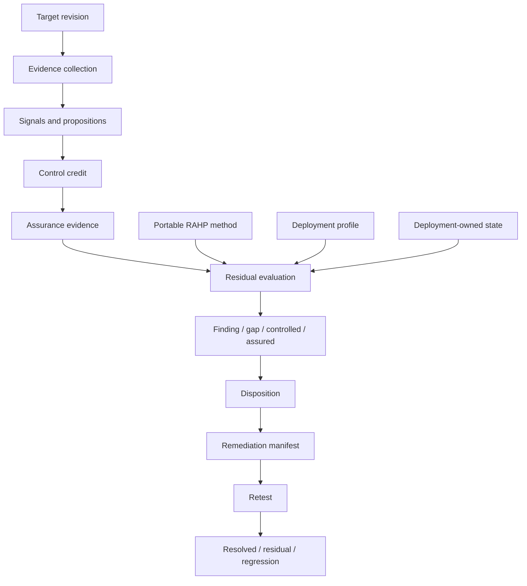

# RAHP Toolkit

**Risk Assessment & Harms Prevention**  
Release v1.2.0 (stable) · Development target v1.5.0 · CC-BY 4.0

RAHP Toolkit is a **portable specification-assurance toolkit** for pressure-testing standards, protocols, implementations and composed systems against human harms, governance failures, adversarial conditions and resilience risks.

> **Project identity:** RAHP Toolkit is the portable method and engine contract. DTG, CAWG/C2PA, OpenVTC, ARPA and other portfolios or projects are independently scoped deployments and examples. No deployment defines the portable method for another adopter. Real-world projects may demonstrate RAHP capabilities, but portable core contracts must remain usable by an unrelated specification, repository, service, dataset or governance process without inheriting project-specific semantics.

> **Development status:** v1.2.0 remains the stable public baseline. Additive capabilities are accumulating on `main` toward **v1.5.0 — Continuous Governed Assurance**; no v1.3.x or v1.4.x releases are planned. See [PROJECT-STATUS.yaml](PROJECT-STATUS.yaml), the [roadmap](ROADMAP.md), and [assurance lineage](docs/assurance-lineage.md).

## What changed in v1.2

RAHP v1.2 moves from signal-centric review to **evidence-driven assurance**.

A detector signal is not automatically a finding. RAHP evaluates the relevant risk proposition against typed evidence, credited controls, assurance evidence and target context before assigning a residual assurance state.

```text
target + pinned revision
  → signals and assurance propositions
  → typed evidence
  → control credit
  → assurance evidence
  → residual assurance conclusion
  → governed remediation
  → evidence-based retest
```

The seven normalized residual states are:

| State | Meaning |
|---|---|
| `assured` | Required propositions are supported by sufficient evidence. |
| `controlled` | The risk exists, but effective controls and assurance evidence are present. |
| `finding` | Evidence supports an actionable residual defect. |
| `assurance-gap` | The control/property may exist, but evidence is incomplete. |
| `review-required` | Automation cannot safely determine the conclusion. |
| `not-assessed` | The proposition was not sufficiently evaluated. |
| `not-applicable` | The proposition is outside applicable scope. |

**Zero findings is not equivalent to assured.** A result can contain no confirmed findings while still carrying unresolved assurance gaps or review obligations.

See the [v1.2.0 release notes](docs/releases/v1.2.0.md), [assurance evaluation](docs/assurance-evaluation.md), [evidence classification](docs/evidence-classification.md), [interpreting results](docs/interpreting-results.md), and [remediation lifecycle](docs/remediation-lifecycle.md).

## Portable assurance model

The reusable catalogue under `method/catalogue/` contains **162 assurance patterns**:

| Prefix | Pattern type | Count |
|---|---|---:|
| `HRM-*` | Human-harm patterns | 24 |
| `RKP-*` | Risk patterns | 43 |
| `CTP-*` | Control patterns | 35 |
| `GRP-*` | Guardrail patterns | 25 |
| `ATP-*` | Assurance-test patterns | 20 |
| `EVP-*` | Evidence patterns | 15 |

The catalogue is complemented by a governed simple-English glossary under `method/glossary/`. Structured method data is authoritative; Markdown, JSON, JSON-LD and rendered site views are derived publication surfaces.

## Start here

| Goal | Start here |
|---|---|
| Understand the method | [How RAHP works](docs/how-rahp-works.md) and [Concepts](docs/concepts.md) |
| Understand v1.2 assurance conclusions | [Assurance evaluation](docs/assurance-evaluation.md) and [Interpreting results](docs/interpreting-results.md) |
| Understand evidence weight | [Evidence classification](docs/evidence-classification.md) |
| Understand durable reassessment history | [Assurance lineage](docs/assurance-lineage.md) |
| Browse reusable assurance patterns | [Portable catalogue](method/catalogue/) and [catalogue guide](docs/portable-assurance-catalogue.md) |
| Run a risks-and-harms review | [Pressure-testing a specification](docs/pressure-testing-a-spec.md) |
| Run a security/adversarial review | [Security and hardening review](docs/security-hardening-review.md) |
| Run both lenses | [Review modes](docs/review-modes.md) |
| Run resilience analysis | [Distributed resilience and amplification](docs/distributed-resilience.md) |
| Test composed specifications | [Cross-spec pressure testing](docs/cross-spec-pressure-testing.md) |
| Configure another portfolio | [Configuration](docs/configuration.md) and [Adopting RAHP](ADOPTION.md) |
| Understand portability | [Portability](docs/portability.md) |
| Implement the engine contract | [Engine contract](docs/engine-contract.md) |
| Contribute | [How to contribute](docs/how-to-contribute.md) and [CONTRIBUTING.md](CONTRIBUTING.md) |

## Quick start

Install the Python dependencies and validate the portable configuration:

```bash
pip install -r requirements.txt
python3 tools/rahp.py config-validate --config examples/configurations/minimal.yaml
python3 tools/rahp.py targets --config examples/configurations/minimal.yaml
python3 tools/validate_portability.py
```

Run the unified review entry point:

```bash
python3 tools/review.py --help
```

Validate the repository and conformance surfaces:

```bash
python3 tools/validate.py
python3 tools/validate_catalogue.py
python3 tools/validate_glossary.py
python3 tools/validate_assurance_lineage.py
python3 tools/validate_pressure_tests.py
python3 tools/validate_security_reviews.py
python3 tools/validate_combined_reviews.py
python3 tools/validate_engine_contract.py
python3 tools/build.py
python3 tools/validate_reference_links.py
```

Build and exercise the TypeScript reference implementation:

```bash
npm install
npm run build:ts
npm run test:ts
```

## Current architecture



The portability invariant is **shared method and engine contract, independent deployment context**. `rahp-engine-contract-v1`, normalized result schema version `1`, and `rahp-evidence-retention-v1` remain the stable compatibility boundaries while v1.5 capabilities are developed additively.

## Evidence-driven resilience

RAHP includes the portable **Distributed Resilience and Amplification Risk Model (DRARM)** for retry storms, reconnect herds, retry multiplication, queue/backpressure collapse, fan-out, poison messages, cascading dependency failure and related amplification risks.

In v1.2 DRARM is a specialized signal provider. Resilience signals map into portable `RKP-*`, `CTP-*`, `GRP-*` and `ATP-*` patterns only where semantic equivalence exists; unmatched rules remain explicitly unmapped rather than being forced into misleading relationships.

```bash
python3 tools/rahp.py resilience --path ../target --repository owner/repository --revision <tag-or-commit>
```

## Remediation and authority

RAHP separates observation, assessment and publication authority.

A remediation manifest can identify the repository or control plane that owns a change, the required outcome and the evidence needed for closure. It does **not** by itself authorize RAHP to create or modify work in an upstream repository.

The default automation boundary remains conservative: RAHP deployment automation creates/coalesces its own assurance work items; external publication requires a separate governance decision or explicit mandate.

## Repository map

| Path | Role |
|---|---|
| `method/` | Portable lifecycle, catalogue, schemas, glossary, mappings and engine/version contracts. |
| `tools/` | Portable orchestration, validation, monitoring, rendering and build tooling. |
| `profiles/<id>/` | Deployment configuration and cross-specification registries. |
| `instances/<id>/` | Deployment-owned state, review records and local assurance vocabulary. |
| `corpora/` | Optional scenario adapters mapped to portable stress patterns. |
| `examples/` | Curated worked assessments and portability fixtures. |
| `packages/` | TypeScript schema/core/graph/CLI reference implementation. |
| `build/` | Generated evidence and publication views. Do not hand-edit generated outputs. |
| `docs/` | Guided documentation and release notes. |
| `archive/` | Historical provenance; not current authority. |

## Compatibility and releases

RAHP v1.2.0 remains the stable release while v1.5.0 is developed as an additive minor release programme. Existing v1.1 and v1.2 normalized results remain valid. The stable boundaries are:

```text
rahp-engine-contract-v1
normalized result schema version 1
rahp-evidence-retention-v1
```

Breaking method or normalized-result changes follow `method/versioning.yaml` and require the corresponding major/schema transition rather than being introduced silently.

Release history is maintained in [CHANGELOG.md](CHANGELOG.md) and [release documentation](docs/releases/).

## AI-assisted use and accountability

AI systems may assist with review, change analysis, scenario generation, evidence organization and drafting. AI output is not, by itself, assurance evidence and does not become a durable finding without review. Durable records should preserve enough provenance to identify material assistance and the accountable human or governance disposition without requiring prompt histories or hidden reasoning.

See [AI-assisted RAHP](docs/ai-assisted-process.md).

## License and provenance

RAHP Toolkit preserves its DTG origin as provenance while operating as an independently reusable assurance toolkit.

**CC-BY 4.0 — reuse with attribution.**
