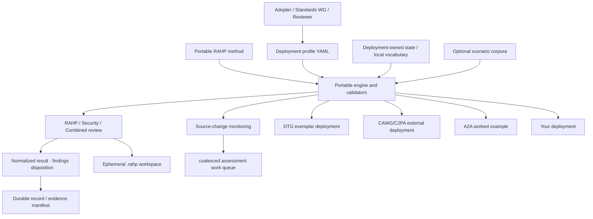

# RAHP Toolkit

**Risk Assessment & Harms Prevention**  
Release v1.0.0 · CC-BY 4.0

RAHP Toolkit is a **portable specification-assurance toolkit** for pressure-testing standards and technical specifications against risks, human harms, governance weaknesses and adversarial/security failure conditions. It provides a reusable method, configuration contract, review tooling, scenario patterns, source-change monitoring, validators and evidence rendering.

> **Project identity:** RAHP Toolkit is the project. DTG and CAWG/C2PA are separately scoped deployments that use it. DTG is the historical origin and bundled exemplar; CAWG/C2PA is the first substantial external deployment. Neither deployment defines the portable method for another adopter.

## Start here

| Goal | Start here |
|---|---|
| Understand the method | [How RAHP works](docs/how-rahp-works.md) and [Concepts](docs/concepts.md) |
| Configure your own repositories | [Configuration-driven adoption](docs/configuration.md) and [Adopting RAHP](ADOPTION.md) |
| Run a risks-and-harms review | [Pressure-testing a specification](docs/pressure-testing-a-spec.md) |
| Run a security/adversarial review | [Security and hardening review](docs/security-hardening-review.md) |
| Run both lenses together | [Review modes](docs/review-modes.md) |
| Exercise scenario stress conditions | [Scenario-driven pressure testing](docs/scenario-driven-pressure-testing.md) |
| Use AI assistance with human accountability | [AI-assisted RAHP](docs/ai-assisted-process.md) and [AI use and accountability](#ai-assisted-use-and-accountability) |
| Understand portability and deployment boundaries | [Portability](docs/portability.md) |
| Inspect the CAWG/C2PA external deployment | [CAWG/C2PA instance](docs/cawg-instance.md) |
| Inspect the bundled DTG exemplar | [DTG instance](docs/dtg-instance.md) |
| Inspect the A2A agent-protocol example | [A2A worked example](docs/a2a-example.md) |
| Understand the engine boundary | [Engine contract](docs/engine-contract.md) |
| Understand review/log retention | [Review evidence and retention](docs/evidence-retention.md) |
| Read the current release | [v1.0.0 release notes](docs/releases/v1.0.0.md) |

## The v1.0 architecture



The portability invariant is **shared method and engine contract, independent deployment context**. The v0.8 engine boundary remains language-neutral: schemas, method data and conformance fixtures are portable rather than tied to an implementation language. v0.9 proves that boundary with independent Python and TypeScript implementations; differential checks require them to agree on normalized-result validity and evidence-retention decisions. Normal run exhaust lives under ignored `.rahp/`, while only compact dispositions/evidence manifests and deliberately curated examples belong in Git. A deployment may own its target repositories, branches, assessment vocabulary, monitoring state, review artefacts and governance decisions without importing another deployment's state.

## Repository architecture

| Path | Role |
|---|---|
| `method/` | Portable RAHP lifecycle, controlled vocabularies, schemas and configuration contract. |
| `tools/` | Portable orchestration, validation, monitoring, rendering and build tooling. |
| `profiles/<id>/` | Deployment configuration: repositories, branches, scope, context and allowed review modes. |
| `instances/<id>/` | Deployment-owned state, review records and optional local assurance vocabulary. |
| `corpora/` | Optional domain scenario adapters mapped to portable `SP-*` stress patterns. |
| `examples/` | Worked assessments and adoption fixtures. |
| `data/` | Bundled DTG exemplar catalogue retained for compatibility and generated evidence; **not the portable RAHP method**. |
| `build/` | Generated evidence and catalogue output. Do not hand-edit. |
| `docs/` | Guided documentation for the toolkit and bundled deployments. |
| `archive/` | Historical provenance only; not current authority. |

See the [repository map](docs/diagrams/repository-map.md) and [portability contract](docs/portability.md).

## Review model

A RAHP review should leave a traceable chain:

```text
target + pinned revision
  → affected people / scenarios
  → triggered deployment risk hypotheses
  → controls / guardrails / evidence
  → finding + disposition
  → recommendation at the correct control plane
  → observable retest trigger
```

RAHP does **not** assume every finding belongs in the specification being reviewed. A finding may route to a companion specification, governance framework, implementation guidance, runtime control, operational policy, formal risk acceptance, or no change when already addressed/out of scope.

The unified review entry point is:

```bash
python3 tools/review.py --help
```

A reviewer may run `rahp`, `security`, or `combined` mode. The tooling scaffolds, validates and renders review evidence; it does not replace the human judgement needed to produce defensible findings.

## AI-assisted use and accountability

RAHP may be used with AI systems to assist activities such as corpus review, change analysis, scenario generation, cross-reference discovery, evidence organization, review preparation and drafting candidate findings or recommendations.

AI assistance does **not** change the assurance boundary:

- AI-generated output is not, by itself, assurance evidence.
- AI-generated analysis does not become a RAHP finding or disposition without human review.
- Durable findings should remain traceable to the reviewed source material, RAHP catalogue entries and supporting evidence.
- Human reviewers remain accountable for assessment scope, interpretation, evidence quality, conclusions, recommendations and disposition.
- Where AI materially influences a durable assessment, reviewers should record that assistance at an appropriate level of detail.

RAHP does not require logging every incidental use of AI tooling. The goal is to preserve meaningful provenance, not complete prompt or conversation histories. When AI assistance materially affects an assessment, a record may identify its purpose and confirm human review without retaining prompts, hidden reasoning, model transcripts or other unnecessary execution exhaust.

For example:

```yaml
assistance:
  ai_used: true
  purposes:
    - change-analysis
    - cross-reference-discovery
    - draft-finding-generation
  human_reviewed: true
  notes: >
    AI assistance was used to identify candidate impacts and draft
    review text. Findings and dispositions were independently reviewed
    against source material by the assessor.
```

The intended accountability chain is:

```text
source evidence
  → AI-assisted interpretation or candidate analysis
  → human review
  → finding
  → disposition
```

This follows the same principle as RAHP's monitoring workflow: an automated observation or candidate analysis may trigger review, but it does not automatically become a finding. See [AI-assisted RAHP](docs/ai-assisted-process.md).

## v0.6 external deployment proof: CAWG/C2PA

v0.6 demonstrates portability with a branch-aware CAWG/C2PA deployment configured through the same engine as DTG. It includes:

- 12 tracked repository/branch targets across CAWG and the C2PA specification substrate;
- eight worked CAWG/C2PA pressure tests;
- an independent `CRK-*` assessment risk namespace under `instances/cawg/data/`;
- branch-aware material-change detection; and
- deduplicated `assessment-required` issue creation in this RAHP review repository.

The CAWG/C2PA deployment is independent assurance work. It does not represent CAWG, DIF or C2PA consensus and does not confer authority to modify upstream specifications. See [CAWG/C2PA RAHP instance](docs/cawg-instance.md).

## Portable persona roles

RAHP now separates reusable actor roles from deployment-specific personas. `P1`–`P6` cover principals/rights-bearing parties, producers, relying parties, intermediaries, delegated service or agent operators, and registry/discovery/trust-service operators. The C2PA/CAWG and A2A worked examples use these roles directly, while `Mxx`, `Bxx`, `Dxx`, and `ECxx` continue to capture machine behaviour, adversaries, and deployment-specific context.

See [Personas and actor roles](docs/personas.md).

## Agent-protocol worked example: A2A

The toolkit now includes an independent worked pressure test of the Linux Foundation **Agent2Agent (A2A) Protocol v1.0.0** under `examples/a2a/`. The assessment credits A2A's existing signed Agent Cards, authorization scoping and push-notification security guidance, then tests the residual trust boundaries created by discovery, multi-agent delegation, secondary credentials and asynchronous execution.

That review adds reusable, protocol-neutral coverage for **discovery metadata vs authority, delegation continuity across agent hops, callback trust, secondary-credential non-transitivity and cross-agent action provenance**. See [A2A protocol worked example](docs/a2a-example.md).

## Bundled DTG exemplar

RAHP originated in DTG Risk Assessment & Harms Prevention work. That provenance is retained, but DTG-specific governance, portfolio discovery and catalogue state are now explicitly an **exemplar deployment**, not a portability requirement.

The bundled DTG catalogue currently contains:

| Prefix | Type | Count |
|---|---|---|
| `RK-xx` | Risk | 48 risks |
| `CT-xx` | Control | 73 controls |
| `GR-xx` | Guardrail | 25 guardrails |
| `AT-xx` | Assurance test | 25 assurance tests |
| `M-xx` | Trust metric | 40 metrics |
| `US-xx` | User story | 36 user stories |
| `SC-xx` | Scenario | 33 scenarios |
| `EPIC-xx` | Capability cluster | 21 EPICs |
| `P/D/M/B/EC` | Persona | 22 personas |
| `REC-x` | Standards recommendation | 9 recommendations |
| `RA-xxx` | Risk acceptance | 3 risk acceptances (all `pending`) |
| `GP-xxx` | Governance precedent | 3 governance precedents |
| `RP-xxx` | Governance rule profile | 1 proposed rule profile |
| `EV-xxx` | Evidence artefact | 5 operational assurance evidence contracts |

These counts are checked by `tools/validate.py`. DTG governance work such as `RP-001`, normative triage and its action queue remains scoped to that deployment unless another adopter explicitly chooses equivalent governance structures.

## v1.0: stable method and implementation conformance

v1.0 stabilizes the portable RAHP method and the `rahp-engine-contract-v1` boundary after independent Python and TypeScript implementation. `@rahp/schema`, `@rahp/core`, `@rahp/graph` and `@rahp/cli` remain non-normative reference packages; shared conformance fixtures and compatibility rules now define what implementations may claim. Python continues to provide the operational monitoring workflows while both implementations are required to agree on the portable behaviors they share.

The normative portable boundary remains `method/engine-contract.yaml`, the normalized result schema, retention policy and shared conformance fixtures. New run scaffolds continue to live under ignored `.rahp/` workspaces by default; Git retains compact assurance state and deliberately promoted exemplars rather than every generated review. See [TypeScript Reference SDK](docs/typescript-sdk.md), [engine contract](docs/engine-contract.md), [review evidence and retention](docs/evidence-retention.md), and [v1.0.0 release notes](docs/releases/v1.0.0.md).

## v0.7: composition and situational assurance

v0.7 deepens the external CAWG/C2PA deployment with a 36-scenario corpus, experimental-branch and cross-specification reviews, CAWG-local security/combined reviews, issue-aware situational monitoring, and a rendered mandate-readiness view. The deployment remains independent of DTG governance and identifiers. See [v0.7.0 release notes](docs/releases/v0.7.0.md), [CAWG/C2PA mandate readiness](docs/cawg-mandate-readiness.md), and [CAWG instance](docs/cawg-instance.md).

## v0.7.1: assessment queue consolidation

v0.7.1 hardens the situational-assurance loop introduced in v0.7.0. Assessment work now has a stable key independent of event titles; repeated material repository revisions advance an open work item; watched upstream issues can attach as triggers to the repository assessment they affect; and durable DTG review records capture disposition and reviewed revision. The release dispositions the initial four generated DTG queue issues and establishes reviewed baselines for Trust Tasks and Verifiable Trust Infrastructure. See [v0.7.1 release notes](docs/releases/v0.7.1.md).

## Quick start

```bash
pip install -r requirements.txt
python3 tools/rahp.py config-validate --config examples/configurations/minimal.yaml
python3 tools/rahp.py targets --config examples/configurations/minimal.yaml
python3 tools/validate_portability.py
```

To validate the bundled repository evidence as maintained here:

```bash
python3 tools/validate.py
python3 tools/validate_pressure_tests.py
python3 tools/validate_project_identity.py
python3 tools/build.py
python3 tools/validate_reference_links.py
```

## Change monitoring

`tools/instance_monitor.py` provides reusable `repository@branch` source monitoring for static deployment profiles, while the DTG adapter additionally discovers its portfolio perimeter. `tools/issue_watch.py` provides a second, allow-listed early-warning channel for upstream architecture/governance issues. Both bundled deployments now use issue-aware monitoring with independent registries and state. `tools/publish_assessment_issues.py` converts material source or selected-issue observations into stable assessment work items. v0.7.1 coalesces repeated repository revisions and related watched-issue triggers into an existing open assessment when possible, preserving event provenance without creating one GitHub issue per observation.

A change issue means **the assessment baseline is stale**, not that a specification is defective. A reviewer must inspect the diff and decide whether RAHP, security or combined evidence requires revision.

## Documentation and contribution

The human documentation is published with Just the Docs on GitHub Pages. Start at [RAHP Toolkit documentation](docs/index.md). Contributions should preserve layer authority: portable method changes belong in `method/`; deployment configuration belongs in `profiles/<id>/`; deployment state and local vocabularies belong in `instances/<id>/`; generated output belongs in `build/` only through the build tools. See [Contributing](CONTRIBUTING.md).

Earlier spreadsheets, personas, requirements and generated views remain available in the [Historical Library](archive/index.md) with explicit historical labeling.

---

*RAHP Toolkit preserves its DTG origin as provenance while operating as a portable, independently reusable assurance toolkit.*  
*CC-BY 4.0 — reuse with attribution.*
