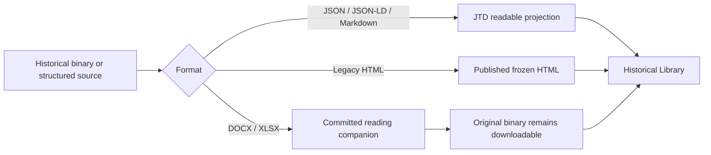

# Historical Library

RAHP retains earlier personas, requirements, registers, workbooks, generated views, and migration artefacts because they explain **how the framework evolved and what earlier analysis contained**.

{: .warning }
> **Historical, not current.** Material under `archive/` is retained for provenance, research, and migration history. Do not treat it as the current canonical RAHP method or instance. Current records live under [`data/`](../data/), portable method material under [`method/`](../method/), corpora under [`corpora/`](../corpora/), and current guidance under [`docs/`](../docs/).

## Start with the historical personas

The most reader-friendly route into the archive is the [historical persona set](historical-builds/persona.jsonld). GitHub Pages renders the retained JSON-LD as a full persona catalogue, including context, goals, risks, inclusion/exclusion drivers, safeguarding notes, adversarial behaviour, and supporting evidence.

You can also read the original [legacy Personas document](legacy-documents/personas.html), or download its retained `.docx` source from that page.

## Historical requirements and analysis

- [Priority Requirements for Standards Development](legacy-documents/priority-requirements-standards-development.html) — readable projection of the retained Word document.
- [Risk Register v4](legacy-spreadsheets/risk-register-v4.html) — readable projection of every worksheet in the retained workbook.
- [User Stories Framework v3](legacy-spreadsheets/user-stories-framework-v3.html) — readable projection of every worksheet in the retained workbook.

The original `.docx` and `.xlsx` files remain alongside these reading views so researchers can inspect the exact historical binaries.

## Historical generated site

The earlier generated RAHP package is also published intact. Useful entry points include:

- [Historical generated home](historical-builds/index.html)
- [Historical risks view](historical-builds/risks.html)
- [Historical matrix](historical-builds/matrix.html)
- [Historical lifecycle view](historical-builds/lifecycle.html)
- [Historical governance view](historical-builds/governance.html)
- [Historical normative view](historical-builds/normative.html)
- [Historical standalone toolkit](historical-builds/rahp-toolkit.html)

These are frozen outputs. They are useful for understanding earlier RAHP behaviour, but current generated evidence belongs under `build/`.

## Historical structured records

Pages also creates readable projections for retained JSON and JSON-LD records, including personas, risks, controls, guardrails, assurance tests, scenarios, user stories, metrics, recommendations, governance precedents, risk acceptances, and coverage data.

| Historical record | Read on Pages |
|---|---|
| Personas | [persona.jsonld](historical-builds/persona.jsonld) |
| Risks | [risk.jsonld](historical-builds/risk.jsonld) |
| Controls | [control.jsonld](historical-builds/control.jsonld) |
| Guardrails | [guardrail.jsonld](historical-builds/guardrail.jsonld) |
| Assurance tests | [assurance_test.jsonld](historical-builds/assurance_test.jsonld) |
| Scenarios | [scenario.jsonld](historical-builds/scenario.jsonld) |
| User stories | [user_story.jsonld](historical-builds/user_story.jsonld) |
| Metrics | [metric.jsonld](historical-builds/metric.jsonld) |
| Recommendations | [recommendation.jsonld](historical-builds/recommendation.jsonld) |
| Governance precedents | [governance_precedent.jsonld](historical-builds/governance_precedent.jsonld) |
| Risk acceptances | [risk_acceptance.jsonld](historical-builds/risk_acceptance.jsonld) |
| Coverage | [coverage.json](historical-builds/coverage.json) |

## How archive publishing works

This gives readers broad access to historical content without silently promoting superseded material into the current RAHP source model.
