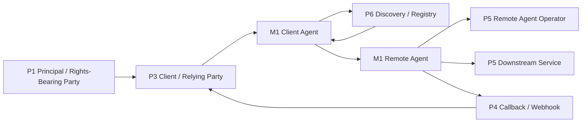

# A2A protocol worked example

RAHP includes a complete worked pressure test of the **Agent2Agent (A2A) Protocol v1.0.0**, pinned to upstream commit `1eb4aa03b07589d3a00ce7deab0dde679120ed30`.

This example broadens RAHP beyond credential, trust-task, and content-authenticity specifications. It shows how the toolkit treats an **agent interoperability protocol** whose implementations may be independently operated, opaque, long-running, and capable of delegating work.

{: .evidence }
The canonical review record is [`examples/a2a/pressure-test.yaml`](../examples/a2a/pressure-test.yaml). The [fully rendered worked assessment]({{ '/examples/a2a/' | relative_url }}) is generated from that record.

## What is being assessed

The assessment focuses on six assurance boundaries:

1. whether signed capability or skill metadata can be confused with authority or trust;
2. discovery origin, registry trust, and metadata freshness;
3. preservation of delegated authority across multiple agent hops;
4. safe use of secondary credentials for downstream systems;
5. asynchronous callback and push-notification assurance; and
6. reconstructable action provenance without requiring disclosure of private model reasoning.

## Finding summary

| Finding | Severity | Main RAHP treatment | Primary personas |
|---|---|---|---|
| F-001 — Signed Agent Card over-read as authority or trust | High | `GR-22`, `CT-68`, `AT-22` | `P3`, `P5`, `P6`, `M1` |
| F-002 — Discovery trust and freshness are deployment-governed | High | `GR-22`, `CT-67`, `AT-22` | `P3`, `P6`, `M1` |
| F-003 — Delegation context can be lost across agent hops | High | `GR-23`, `CT-69`, `CT-73`, `AT-23` | `P1`, `P3`, `P5`, `M1` |
| F-004 — Secondary credentials need a non-transitivity boundary | High | `GR-25`, `CT-72`, `AT-25` | `P1`, `P5`, `M1` |
| F-005 — Push security requires deployment assurance evidence | High | `GR-24`, `CT-70`, `CT-71`, `AT-24` | `P4`, `P5`, `M1`, `M2` |
| F-006 — Opaque execution still needs action provenance | Medium | `GR-23`, `CT-73`, `AT-23` | `P1`, `P3`, `P5`, `M1` |

See the [full finding evidence and recommendations]({{ '/examples/a2a/#detailed-findings' | relative_url }}).

## What A2A already does well

The review deliberately **credits controls that already exist**. It does not treat ordinary protocol security as absent simply to create findings. In particular, A2A v1.0 already provides or documents:

- signed Agent Cards using JWS and canonicalization;
- authentication and authorization scoping;
- HTTPS and standard enterprise security mechanisms;
- long-running task and streaming semantics;
- explicit webhook/SSRF concerns;
- callback authentication and replay mitigations; and
- distributed tracing, logging, and auditing guidance.

The RAHP findings therefore concentrate on the remaining **semantic and governance boundaries**: what a signed capability claim means, whose authority survives delegation, when a credential may transit to another service, who governs discovery, and what evidence is needed for accountable action.

## Why the catalogue expanded

A2A exposed reusable boundaries that were not represented cleanly in the earlier catalogue:

| Boundary | Guardrail | Risks |
|---|---|---|
| Discovery metadata versus authority | [`GR-22`](../build/site/catalogue.html#GR-22) | [`RK-AI05`](../build/site/catalogue.html#RK-AI05), [`RK-AI06`](../build/site/catalogue.html#RK-AI06) |
| Delegation continuity across agent hops | [`GR-23`](../build/site/catalogue.html#GR-23) | [`RK-AI07`](../build/site/catalogue.html#RK-AI07) |
| Asynchronous callback trust | [`GR-24`](../build/site/catalogue.html#GR-24) | [`RK-AI08`](../build/site/catalogue.html#RK-AI08) |
| Secondary credential non-transitivity | [`GR-25`](../build/site/catalogue.html#GR-25) | [`RK-AI09`](../build/site/catalogue.html#RK-AI09) |

Seven associated controls (`CT-67`–`CT-73`), four assurance tests (`AT-22`–`AT-25`), and three metrics (`M-38`–`M-40`) make those boundaries testable rather than merely descriptive.

These additions are **protocol-neutral**. They can be reused for other agent protocols, MCP-mediated systems, delegated commerce, personal-agent ecosystems, enterprise agent meshes, and similar multi-agent environments.

## Persona model

The A2A review is also the clearest demonstration of why RAHP separates **machine behaviour** from **institutional accountability**.

For example:

`P1 Principal → P3 Relying Party → M1 Agent → P5 Remote Agent Operator → P5 Downstream Service`

`M1` tells us how the machine behaves. `P5` tells us who operates it and who bears an assurance obligation. See [Personas and actor roles](personas.md).

## Control-plane discipline

Not every finding belongs in the A2A core specification. The review deliberately routes findings among:

- `specification` for a semantic non-inference boundary;
- `companion-specification` where interoperable delegation or credential semantics may be needed;
- `implementation-guidance` for callback assurance and provenance; and
- `governance` for discovery trust and registry policy.

RAHP evaluates whether an assurance obligation is covered **at the correct control plane**, not whether every risk can be solved by adding another field to a protocol.

## Reproducing and inspecting the example

- [Canonical A2A pressure-test YAML](../examples/a2a/pressure-test.yaml)
- [Rendered A2A pressure test]({{ '/examples/a2a/' | relative_url }})
- [Pressure-testing workflow](pressure-testing-a-spec.md)
- [Agent delegation governance](agent-delegation-governance.md)
- [Persona model](personas.md)
- [RAHP catalogue](../build/site/catalogue.html)

## Actor-chain follow-up

A2A issue #2028 was reviewed separately on 2026-08-20 as an informative proposal. It sharpens the original delegation findings without changing the pinned A2A v1.0 target. RAHP now carries reusable patterns for lineage-as-authority confusion, prior-hop mutation, evidence-state collapse, cross-context evidence replay, and lineage correlation exposure. See [Actor-chain delegation assurance](actor-chain-delegation-assurance.md).
