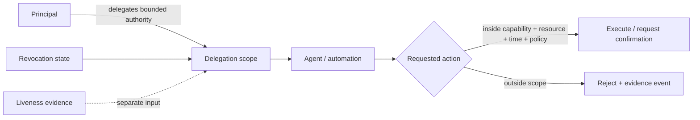
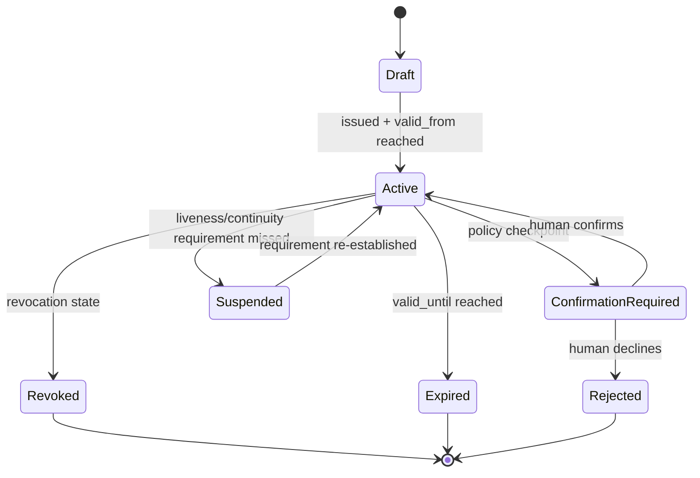

# Agent delegation governance

RAHP v0.4 separates four questions that are often collapsed:

1. **What kind of non-human actor is operating?**
2. **What authority has actually been delegated?**
3. **Is the delegation still valid/revocable?**
4. **What liveness or continuity evidence, if any, is separately required?**

A DID, signing key, liveness proof, or personhood proof does not by itself establish
delegated authority.

## Portable actor taxonomy

`method/non-human-actors.yaml` defines three operating classes:

| ID | Class | Key distinction |
|---|---|---|
| `NHA-AUTONOMOUS` | Autonomous agent | acts within scope without per-action approval |
| `NHA-SUPERVISED` | Supervised agent | defined human confirmation/checkpoint boundaries |
| `NHA-PIPELINE` | Automated pipeline | bounded preconfigured workflow rather than adaptive agent decisions |

The class is contextual. The same software can operate under different authority in
different transactions.

## Delegation-scope contract

`method/schema/delegation-scope.schema.json` defines a portable constraint envelope for:

- principal and delegate;
- actor class;
- capabilities and resource scope;
- human-confirmation and transaction constraints;
- validity interval;
- revocation mechanism and notification SLA;
- optional liveness requirements;
- provenance.

A conforming worked example is available at `examples/agent-delegation-scope.yaml`.

## Delegation state flow

## Assurance boundary

The schema is a **method primitive**, not a new DTG credential format. A specification
may map these semantics into its own credential/profile model. RAHP pressure tests should
verify that whatever representation is chosen preserves the same authority boundaries.

The v0.4 runtime pilot connects delegated-scope violations to `M-08`/`EV-004` and
liveness-interval compliance to `M-27`/`EV-005`.
