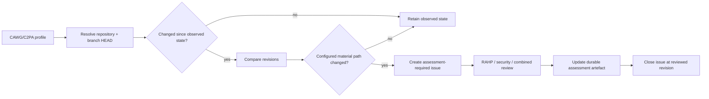

# CAWG/C2PA RAHP instance

v0.6.0 adds the first substantial **external deployment** of the portable RAHP engine. The
instance tracks the CAWG specifications linked from `cawg.io/specs/`, selected published
experimental Identity branches, the next Organizational Identity profile branch, and the C2PA
technical-specification repository that provides the underlying manifest/assertion substrate.

This is an **independent assurance deployment**. It does not represent CAWG, DIF or C2PA consensus,
and it does not confer authority to change upstream specifications.

## Tracked scope

The canonical target list is [`profiles/cawg/rahp.yaml`](../profiles/cawg/rahp.yaml). It currently
includes:

- CAWG Identity Assertion, plus governance, VC/VP and vLEI experimental branches;
- CAWG Metadata Assertion;
- CAWG Training and Data Mining Assertion;
- CAWG Consent Assertion;
- CAWG Endorsement Assertion;
- CAWG Organizational Identity Profile, including its next-version branch;
- CAWG User Experience Guidance; and
- the C2PA Technical Specification repository.

The profile is branch-aware because material experimental work can occur without changing a
repository's `main` branch.

## Initial v0.6.0 pressure tests

The first worked assessment pack lives at [`examples/cawg-c2pa/`](../examples/cawg-c2pa/). It
contains eight RAHP pressure tests covering the main CAWG/C2PA specification surfaces. The tests
focus on adoption and mandate pressure rather than only syntax:

- identity versus domain authority;
- metadata integrity versus factual authority;
- training/mining signals versus authorization;
- consent authority, precedence and lifecycle;
- endorsement as bounded delegation;
- organizational trust-anchor and role lifecycle;
- user interpretation, failure states and accessibility; and
- C2PA validation versus higher-layer relying-party trust decisions.

## Change-to-review flow

`tools/instance_monitor.py` implements the portable static-profile monitor. State keys use
`repository@branch`, so multiple tracked branches of the same upstream repository are independent.
`tools/publish_assessment_issues.py` deduplicates GitHub issues by event title and creates the
configured labels if needed.

The scheduled/manual `.github/workflows/instance-watch.yml` runs both the existing DTG discovery
adapter and this external profile monitor, files assessment issues, and persists observed revisions.

## What a change issue means

An `assessment-required` issue is a queue record, **not a finding**. It says only that a tracked
revision changed in material scope and the previous assessment baseline is stale. The reviewer must
inspect the diff and decide whether the RAHP, security or combined artefacts need substantive change.

## Governance boundary

RAHP routes recommendations to the narrowest effective control plane. A CAWG/C2PA finding may be
best addressed in an upstream specification, a companion profile, governance policy, implementation
guidance, runtime controls, procurement requirements, or no upstream change at all. The assessment
must preserve that boundary rather than treating every harm as a defect in the specification text.
