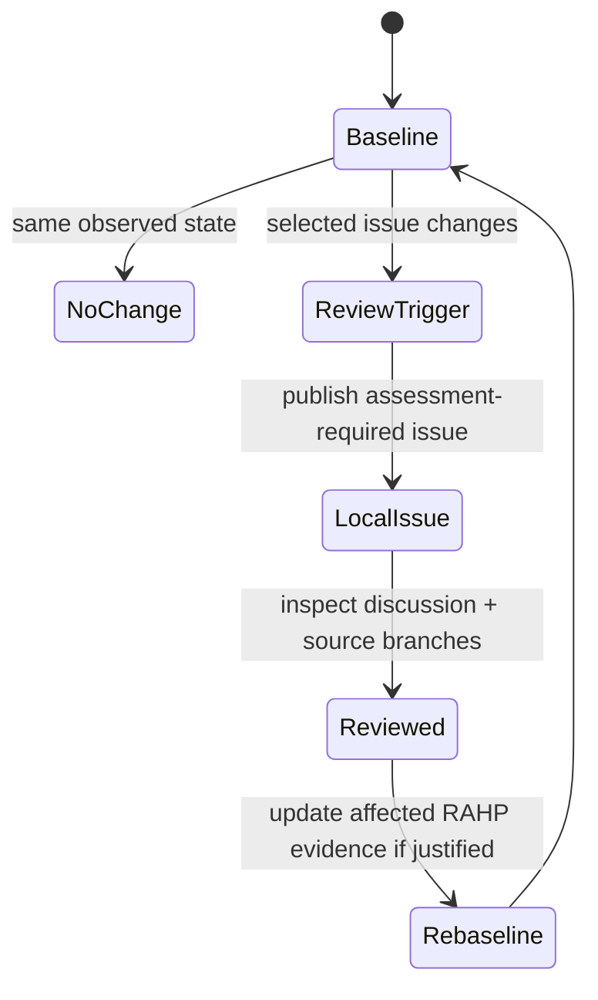

# CAWG/C2PA situational monitoring

v0.7 uses two independent early-warning channels for the external CAWG/C2PA deployment. Neither channel changes an assessment automatically.

## 1. Normative-source drift

`tools/instance_monitor.py` watches configured `repository@branch` targets from `profiles/cawg/rahp.yaml`. A material change to tracked specification paths creates an `assessment-required` event. The event records the previously observed revision and the new revision so a reviewer can determine which pressure tests need to be re-run.

## 2. Selected architecture/governance issue drift

`instances/cawg/watch/issues.yaml` is an explicit allow-list of upstream issues whose discussion can materially change assumptions used by RAHP before normative text lands. The current themes include trust registries/TRQP, governance assertions, delegation and agents, generalized credential trust, archival verification, consent state, assurance levels, privacy and alternative trust methods.

`tools/issue_watch.py` records issue `updated_at`, state, title and comment count from the CAWG allow-list. The first observation establishes a baseline without opening a local issue. A later change emits a publisher-compatible event labelled `assessment-required` and `cawg-instance`.

{: .warning }
Issue activity is **not normative evidence**. It is a situational-awareness trigger. Findings remain grounded in specifications, reviewed branch content and explicitly cited evidence.

## Event lifecycle

The local issue title includes the upstream issue number and the observed `updated_at` marker. Re-running the same state is deduplicated; a later upstream update can create a new review trigger.

## Why both channels are needed

Repository monitoring answers **what normative or draft source changed?** Issue monitoring answers **which emerging architecture decision may change the next review even before it becomes specification text?** Keeping them separate prevents discussion from being mistaken for normative authority while still allowing RAHP to track a fast-moving specification programme.

The same portable issue-watch mechanism is also used by the DTG deployment with its own independent allow-list, labels and state. Selection in one deployment has no effect on the other.
