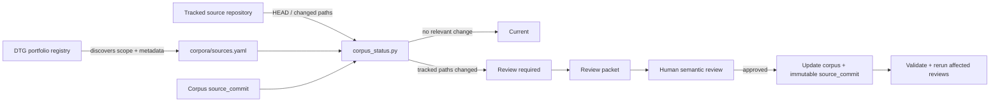
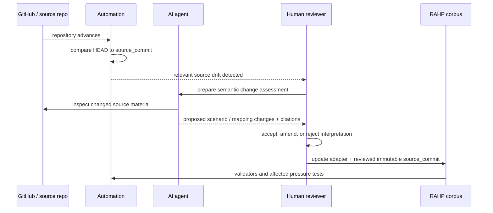

# Corpus synchronization and provenance

RAHP corpora are curated adapters over source specifications. They are **not live mirrors**. A pressure-test result must remain reproducible against an immutable source snapshot even when the related repository continues to evolve.

The synchronization model therefore separates **portfolio discovery**, **source drift detection**, **semantic adaptation**, and **human approval**.



## What the portfolio monitor does

The DTG Portfolio Monitor repository registry is used as a **discovery and portfolio-scope control plane**. It tells RAHP which repositories are part of the monitored DTG landscape and supplies useful metadata such as workstream, lifecycle, role, reporting weight and material paths.

It does **not** decide which source a RAHP corpus must use. `corpora/sources.yaml` records that choice explicitly. This matters for forks: `CORPUS-DTG-ZKP` currently tracks `sankarshanmukhopadhyay/dtgwg-zkp-tf`, while mapping it to the portfolio entry `trustoverip/dtgwg-zkp-tf` as its upstream portfolio relationship.

## Multi-source external corpora

v0.7 removes a remaining DTG assumption from corpus validation. A corpus source must declare its primary repository and tracked paths, but `portfolio_repository` and `relationship_to_portfolio` are required only when the deployment actually uses a portfolio registry. External adapters may declare `additional_repositories` for composed or portfolio-wide scenario sources. The CAWG/C2PA corpus uses this form; normative repository drift is independently covered by the CAWG deployment profile monitor.

## Source of truth hierarchy

| Question | Authority |
|---|---|
| Which repositories are in monitored DTG scope? | DTG Portfolio Monitor `config/repositories.yaml` |
| Which repository/path does this RAHP corpus adapt? | `corpora/sources.yaml` |
| Which exact source state was semantically reviewed? | `corpus.source_commit` |
| What transformation/mapping revision was used? | `corpus.adapter_version` |
| What scenarios and `SP-*` mappings are authoritative in RAHP? | the individual `corpora/*.yaml` adapter |

## Status model

`tools/corpus_status.py` reports one of the following states:

- **UNPINNED_REVIEW_REQUIRED** — a legacy/archive snapshot has not yet been re-baselined to an immutable commit SHA.
- **UP_TO_DATE** — the pinned SHA equals the current tracked branch HEAD.
- **SOURCE_CHANGED_NO_CORPUS_IMPACT** — the repository advanced but configured corpus source paths did not change.
- **CORPUS_REVIEW_REQUIRED** — configured source material changed after the pinned commit.
- **PINNED_NOT_CHECKED** — offline validation confirmed an immutable pin but intentionally did not query GitHub.
- **DEPENDENCY_REVIEW_REQUIRED / RECOMPOSITION_NOT_TRIGGERED** — status for a composed corpus whose lifecycle depends on other corpora.
- **CHECK_FAILED** — GitHub or configuration status could not be evaluated.

## Why the current corpora remain `archive-snapshot`

The first synchronization release does **not** rewrite an existing `source_commit: archive-snapshot` to today's repository HEAD. Doing so would claim provenance that has not been established. Instead, the source registry records an observed bootstrap HEAD separately and treats each legacy corpus as requiring a one-time semantic re-baseline.

After a reviewer confirms that a corpus accurately represents a concrete source commit, replace `archive-snapshot` with that full 40-character SHA and change the provenance status accordingly.

## Scheduled status check

`.github/workflows/corpus-status.yml` runs daily and can also be launched manually. It:

1. loads `corpora/sources.yaml`;
2. obtains the current tracked HEAD using the GitHub API;
3. compares it with the corpus's immutable pin when one exists;
4. inspects changed filenames against the configured source paths;
5. writes Markdown and JSON status reports to the workflow summary/artifact.

The workflow is deliberately read-only. Detection is automatic; semantic modification is not.

## Preparing a review packet

Use the manual **Prepare corpus review packet** workflow, or locally:

```bash
python3 tools/corpus_review.py CORPUS-DTG-CREDSPEC --output build/corpus-review.md
```

The packet captures provenance, observed HEAD, relevant source changes, a reviewer checklist and an AI-agent handoff contract. It does not modify the corpus or advance its source pin.

## Human and AI responsibilities



An AI agent may compare versions, classify changes, propose scenario edits, find moved anchors and run validators. It must not silently decide that changed normative text is semantically equivalent or advance `source_commit` without accountable review.

## Composed corpora

A composed corpus such as `CORPUS-TT-CREDSPEC-COMPOSED` tracks **corpus dependencies**, not a synthetic Git repository. Its `depends_on` block identifies the adapter versions and source baselines from which the cross-spec scenarios were composed. Re-baselining either dependency should trigger recomposition review.
