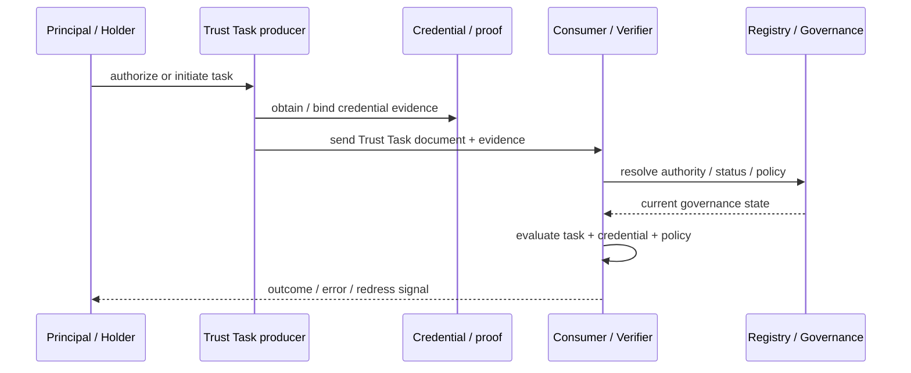

# Cross-specification pressure testing

RAHP can test not only a specification in isolation but also the **contract between specifications**. This matters when one document supplies a trust artefact and another supplies the execution semantics that consume it.

For the DTG Credential Specification and Trust Tasks, the high-level interaction is:

## The seam is a first-class test surface

A credential may be cryptographically valid while its issuer is no longer authoritative. A task may be correctly signed while its principal has changed intent. A `taskContext` may bind a credential to an exchange without proving that the exchange completed successfully. These are not necessarily defects in either component individually; they are **composition risks**.

The reference composed corpus is [`corpora/trust-tasks-credspec-composed.yaml`](../corpora/trust-tasks-credspec-composed.yaml).

## Review rule

For each composed scenario, reviewers should ask:

1. Which specification owns each semantic fact?
2. Which facts are evaluated at issuance, authorization, presentation and execution time?
3. Which dependencies can change between those moments?
4. Which party is responsible for re-evaluation?
5. What evidence survives for later audit or appeal?
6. Where does remediation belong: core spec, companion spec, governance, runtime, or operational policy?

## Coverage is directional

A cross-spec finding should identify whether the remediation belongs primarily to Trust Tasks, CredSpec, both, or an external governance/runtime layer. RAHP's `primary_disposition` remains the routing mechanism; the scenario corpus supplies the test condition, not the ownership decision.

## v1.1 portable assurance mapping

Cross-spec reviews should map local findings to portable `RKP-*`, `CTP-*`, `GRP-*`, `ATP-*` and `EVP-*` patterns where a reusable mechanism exists. This does **not** replace deployment-specific risks or disposition; it makes the seam comparable across ecosystems.

The maintained worked assessment is [`examples/cross-spec/trust-tasks-credspec/pressure-test.yaml`](../examples/cross-spec/trust-tasks-credspec/pressure-test.yaml), with a generated readable view in its README. A combined synthesis also links this RAHP review to the existing composition security threat model.

A useful closure condition is therefore stronger than “both component specifications validate”: the composition should demonstrate semantic ownership, lifecycle alignment, authority continuity, privacy composition and contestability evidence at the seam.
