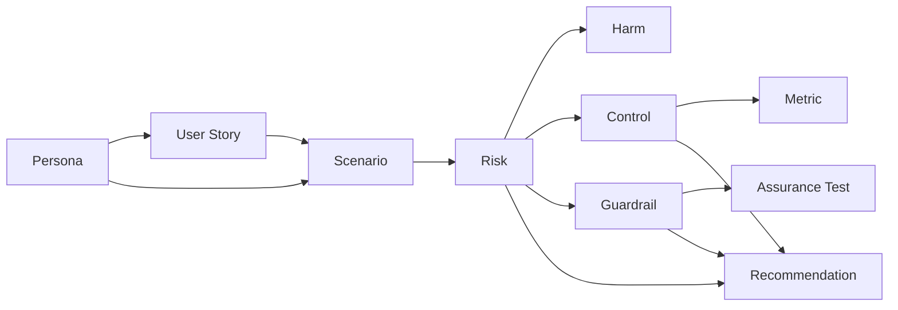

# Artefact relationships

```mermaid
flowchart LR
  P[Persona] --> U[User Story]
  P --> S[Scenario]
  U --> S
  S --> R[Risk]
  R --> H[Harm]
  R --> C[Control]
  R --> G[Guardrail]
  G --> A[Assurance Test]
  C --> M[Metric]
  R --> REC[Recommendation]
  G --> REC
  C --> REC
```

This view is intentionally conceptual. The machine-verifiable cross-reference rules are defined by `data/instance.yaml` and enforced by `tools/validate.py`.
