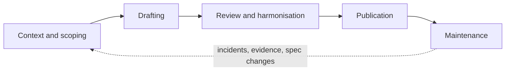

# RAHP assurance lifecycle

```mermaid
flowchart LR
  C[Context and scoping] --> D[Drafting]
  D --> R[Review and harmonisation]
  R --> P[Publication]
  P --> M[Maintenance]
  M -. incidents, evidence, spec changes .-> C
```

The detailed machine-readable lifecycle, including known gaps and evidence expectations, is canonical in `method/lifecycle.yaml`.
