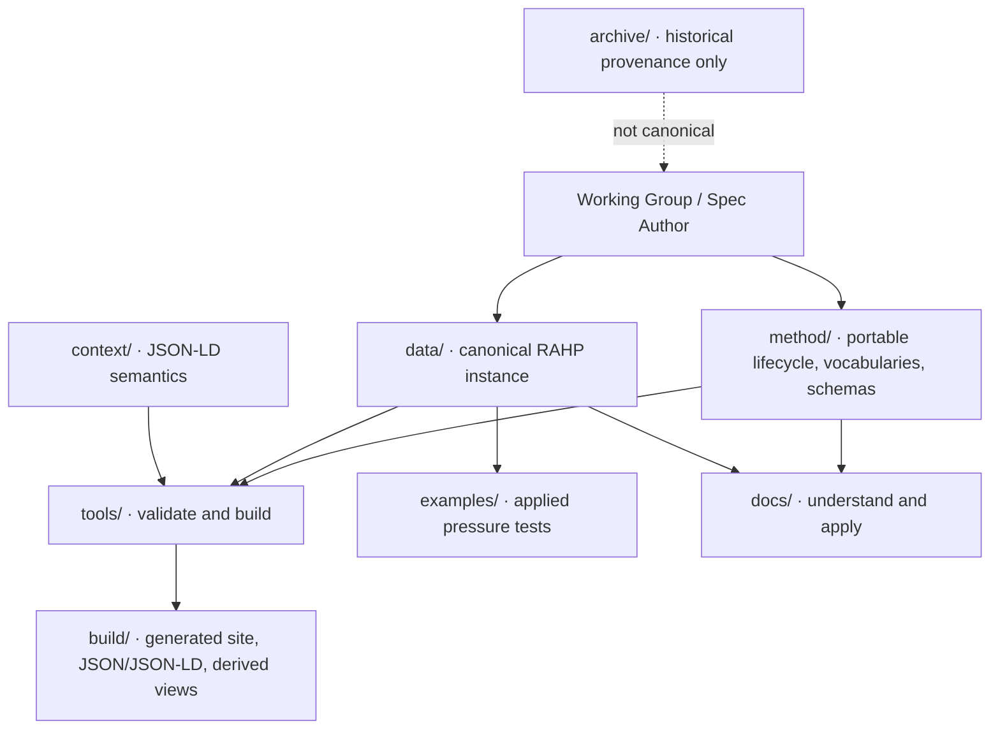

# Repository map

## Edit contract

- Edit `data/` for DTG facts and findings.
- Edit `method/` only for portable method changes.
- Edit `tools/` to change validation/build behaviour.
- Never hand-edit `build/`.
- Treat `archive/` as read-only provenance.
