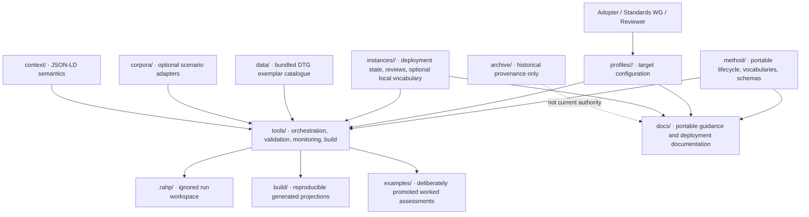

# Repository map

## Authority boundaries

- Edit `method/` only when changing **portable RAHP semantics**.
- Edit `profiles/<id>/` when changing a deployment's configured target repositories, branches, scope or allowed review modes.
- Edit `instances/<id>/` for deployment-owned state, reviews and local assurance vocabulary.
- Root `data/` is the **bundled DTG exemplar catalogue retained for compatibility**; it is not the universal RAHP data model that every adopter must inherit.
- `corpora/` contains optional domain adapters. A deployment may use none, some, or its own.
- Treat `.rahp/` as disposable run-local workspace; do not commit it.
- Never hand-edit reproducible files under `build/`.
- Promote material into `examples/` only when it is intentionally maintained as an exemplar.
- Treat `archive/` as historical provenance, not current RAHP authority.

The v0.8 architecture is therefore **one language-neutral method/engine contract, many conforming implementations and independently governed deployments**, with Git retaining assurance state rather than run exhaust.
