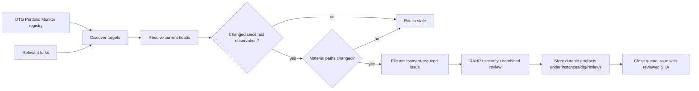

# DTG RAHP instance

The repository serves two purposes without coupling them:

1. **Portable toolkit:** `method/`, `tools/rahp.py`, schemas, validators and generic configuration examples can be used by any adopter.
2. **DTG deployment:** `instances/dtg/` applies that toolkit operationally to the DTG ecosystem.

## Portfolio scope

The DTG deployment reads `config/repositories.yaml` from `sankarshanmukhopadhyay/dtg-portfolio-monitor`.
It then discovers repositories owned by the configured fork owner and includes a fork only when
GitHub reports that its parent is one of those portfolio repositories. This avoids maintaining a
second hand-written list and allows new monitored repositories and new relevant forks to enter the
DTG assessment perimeter automatically.

`instances/dtg/generated/repositories.yaml` is a generated, auditable snapshot of that resolved perimeter.

## Change-to-review flow

The automation does not claim that a changed repository contains a defect. It creates an
**assessment queue record** when changed files intersect the portfolio's material paths.

## Issue-aware early warning

Repository drift is not the only way the DTG risk picture changes. `instances/dtg/watch/issues.yaml` now maintains a curated allow-list of architecture, security, lifecycle and cross-specification issues whose evolution can invalidate assumptions in an existing review before normative text is merged. `tools/issue_watch.py` baselines those issues silently and emits `assessment-required` events only after a selected issue changes.

This is intentionally **not** a watch of every DTG issue. See [DTG situational monitoring](dtg-situational-monitoring.md) for the selection rule and the boundary between discussion evidence and normative source material.

## Workflows

- `instance-watch.yml`: scheduled and manual change-review queue for the DTG and CAWG/C2PA instances; DTG uses its portfolio-discovery adapter for repository scope and the shared issue watcher for selected upstream architecture issues.
- `configured-review.yml`: generic on-demand RAHP runner for any YAML profile.
- Existing validation, corpus and Pages workflows remain independent.

For a fresh deployment baseline, run the monitor with `--initialize`. This records current heads without opening
issues for the entire existing portfolio. Subsequent runs compare from that baseline.
