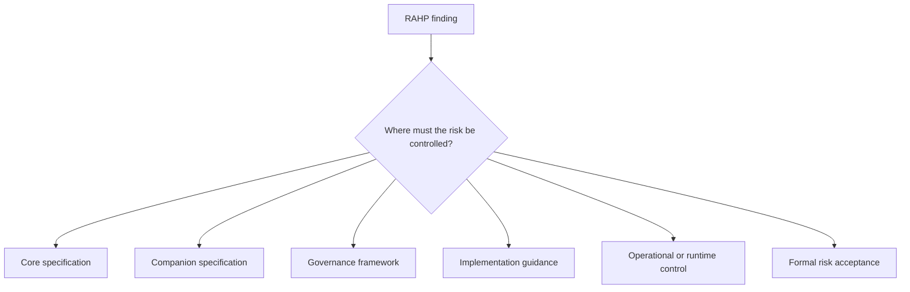

# Governance boundaries and finding disposition

Every finding needs a control plane. Use exactly one primary disposition, plus references where applicable.

| Disposition | Use when |
|---|---|
| `specification` | The core specification can legitimately define and test the requirement. |
| `companion-specification` | A protocol/profile/binding outside the core specification owns the mechanism. |
| `governance` | Authority, eligibility, accountability, redress or decision rights must be defined by governance. |
| `implementation-guidance` | The requirement is best satisfied through non-normative implementation advice. |
| `runtime-control` | The mitigation depends on monitoring, enforcement, revocation or operational state. |
| `operational-policy` | Organisational process/policy, rather than protocol semantics, is the effective control plane. |
| `out-of-scope` | The finding is valid but deliberately outside the assessed target. |
| `risk-accepted` | An authorised body formally accepts residual risk under explicit scope/conditions. |
| `already-addressed` | Existing text/control already resolves the finding. |
| `resolved-by-pr` | A tracked change resolves the finding; record the PR/change reference. |

The central rule is: **identify the narrowest control plane that has both legitimate authority and an enforceable/evidentiary path.**
