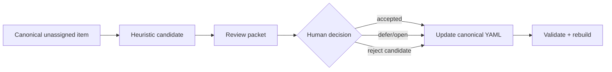

# Normative triage in RAHP v0.4

The largest remaining governance backlog is the set of controls and guardrails whose
`standards_status` remains `unassigned`. RAHP v0.4 does **not** auto-assign those
statuses. Instead, the build produces `build/normative-triage.md`, a deterministic
decision-support workbench.

## Why this is safer

A candidate classification is useful for prioritisation, but it is not a standards
decision. The generated workbench may suggest `normative_candidate`, `recommended_practice`,
or `informative_guidance` based on risk linkage, standards relevance, and source wording.
Canonical YAML changes only after human review.



## Review protocol

For each item the reviewer should determine:

1. the correct control plane;
2. whether the item is normative, recommended, informative, open, or deferred;
3. whether RFC 2119/8174 language is justified;
4. the rationale for that classification;
5. whether linked risks/guardrails/controls remain accurate.

Run:

```bash
python3 tools/build.py
```

and review `build/normative-triage.md`.

The generated candidate field is **never** authoritative and should not be cited as
a Task Force decision.
