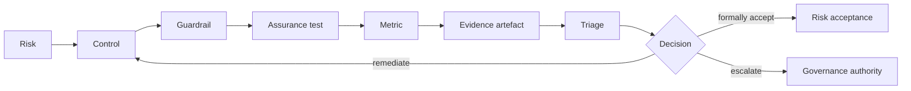
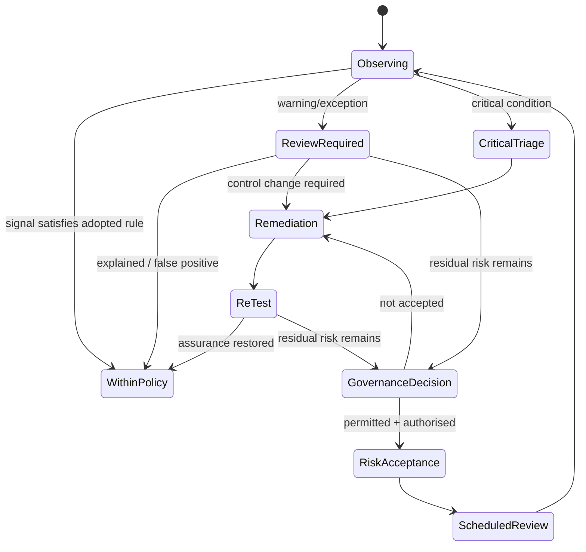
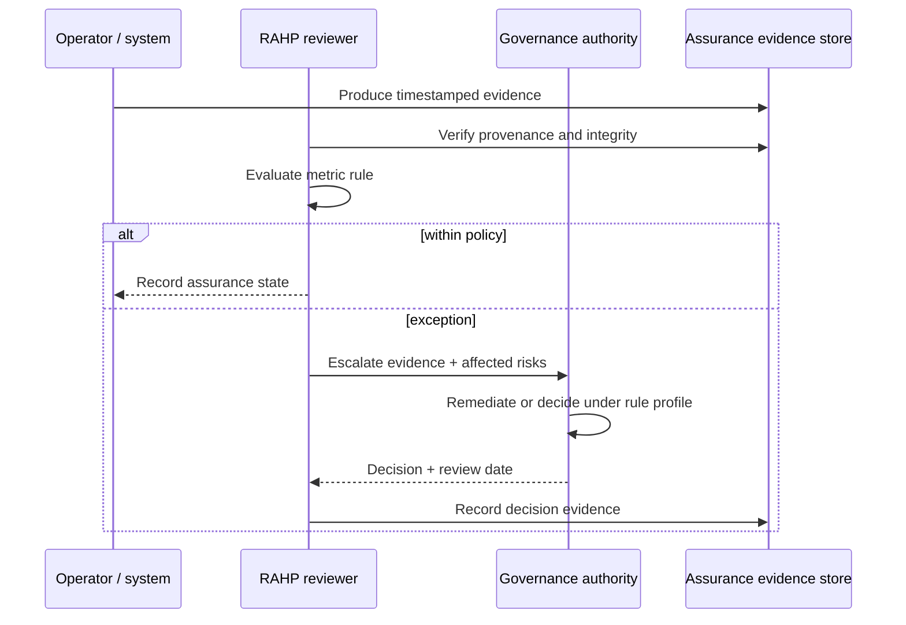

# Operational assurance in RAHP v0.4

RAHP v0.4 adds a bounded operational-governance layer. The objective is not to turn
RAHP into a production monitoring platform. It is to make the assurance contract
explicit: **what signal matters, what evidence establishes it, what state change
requires attention, and who is accountable for the next decision**.

The five pilot monitoring contracts in `data/metrics.yaml` are deliberately marked
`pilot_proposed`. They demonstrate the model without asserting that a DTG deployment
currently collects those signals or that the Task Force has ratified numeric thresholds.

## Assurance chain

## Five-metric pilot

| Metric | Purpose | Evidence contract |
|---|---|---|
| `M-02` | Revocation-notice timeliness | `EV-001` |
| `M-04` | IDVP issuer verification before VMC issuance | `EV-002` |
| `M-06` | Rejection of unauthorised registry writes | `EV-003` |
| `M-08` | Agent delegated-scope violations | `EV-004` |
| `M-27` | Operator/agent liveness interval compliance | `EV-005` |

The evidence contracts are templates. `uri`, `digest`, and `collected_at` remain null
until a real assessment produces evidence.

## Triage state flow

## Responsibility swimlane

## Governance profile

`data/rule-profiles.yaml` introduces `RP-001`, a **proposed** machine-readable
translation of ROADMAP Q3/Q4. It does not automatically grant anybody authority.
The profile becomes operational only after the relevant human governance body
ratifies it.

Critical risks remain non-acceptable. For other risks the profile can express the
required authority, evidence threshold, and review cadence.

## Evidence artefacts

`data/evidence-artifacts.yaml` adds first-class evidence contracts. An evidence
record can identify its metric, collector role, source kind, retention class,
sensitivity, URI/hash, collection time, and applicable assurance tests.

This closes an important gap between "we have a metric" and "we can demonstrate
why the assurance conclusion was reached."

## Human and AI-agent boundary

An AI agent may collect candidate evidence, check references, evaluate deterministic
threshold rules, prepare a triage packet, and propose mappings. It must not:

- fabricate evidence;
- mark a proposed rule profile as ratified;
- make a risk-acceptance decision;
- advance an acceptance authority field without a human governance decision.

See [Using an AI agent](using-an-ai-agent.md) for the broader workflow.
