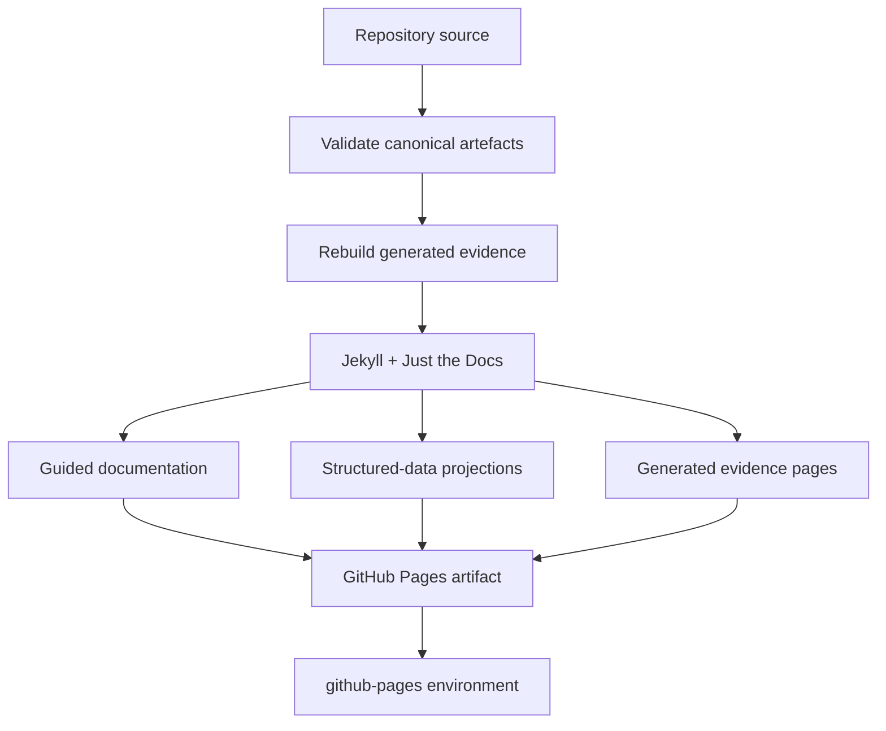

# GitHub Pages coverage

The Pages site is intended to expose the **maximum useful human-readable surface** of the RAHP repository while preserving the repository files as the canonical source of truth.

## What is published

| Repository surface | Pages treatment |
|---|---|
| Guided Markdown documentation | Rendered with Just the Docs and included in search/navigation where appropriate. |
| Canonical YAML/JSON/JSON-LD under `corpora/`, `method/`, `data/`, `build/derived/`, `build/jsonld/`, and `examples/` | Rendered at the original file path as a readable structured-data page, with a link back to canonical GitHub source. |
| Generated evidence views under `build/site/` | Published as generated HTML drill-down surfaces. |
| Top-level guides and worked example Markdown without Jekyll front matter | Rendered at their original `.md` paths as JTD pages, with canonical-source links. |
| Repository archive/legacy material | Published through a clearly labelled Historical Library. Structured records receive readable projections; frozen legacy HTML is served intact; retained DOCX/XLSX files have committed reading companions while the original binaries remain downloadable. |
| Tooling and Python source | Kept in GitHub rather than duplicated into the documentation site. |

{: .evidence }
A URL such as [`/corpora/dtg-zkp.yaml`](../corpora/dtg-zkp.yaml) is therefore a **human-readable projection** on GitHub Pages. The corresponding file in the GitHub repository remains the canonical YAML used by validation and automation.

## Publishing flow

## Coverage is intentionally selective

"Maximum coverage" does not mean publishing every file as first-class documentation. Build scripts, dependencies and workflow internals remain in GitHub. Historical artefacts are published through the clearly labelled Historical Library because earlier personas, registers and analysis can materially help a reader understand how RAHP evolved, while current and historical authority remain explicitly separated.

The deployment pipeline fails before publication when canonical validation fails or generated evidence is stale. This keeps Pages a projection of a coherent repository state rather than a separate documentation fork.

## v0.4 operational assurance

The Pages projection also renders the v0.4 structured method and instance additions,
including `data/rule-profiles.yaml`, `data/evidence-artifacts.yaml`,
`method/non-human-actors.yaml`, and `method/schema/delegation-scope.schema.json`.
Reader guides for normative triage, operational assurance, agent delegation governance,
and the v0.4.0 release are part of the required Pages coverage contract.
