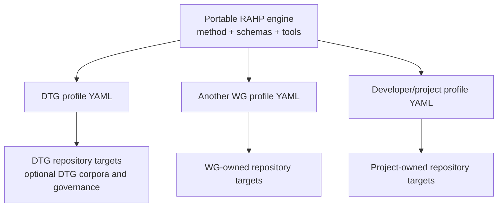

# Portability

RAHP v0.5 defines portability operationally: **the adopter supplies configuration, not a replacement copy of the DTG instance**.



## v0.5 portability contract

An adopter must be able to:

1. checkout RAHP without deleting or editing DTG exemplar material;
2. create one YAML file listing one or more repositories and their context;
3. validate the file against the portable RAHP configuration schema;
4. resolve target revisions with pinned commits, local Git checkouts, or configured remote branches;
5. select RAHP, security, or combined review mode per target;
6. scaffold assessment records without loading DTG corpora, DTG issues, DTG governance records, or the DTG Portfolio Monitor; and
7. retain full commit-level provenance for each assessment.

## Mechanical proof

`tests/fixtures/portable-project/rahp.yaml` is deliberately non-DTG. CI runs:

```bash
python3 tools/validate_portability.py
```

The fixture must validate, list its targets, and resolve dry-run scaffolding for all three review modes while containing no DTG repository, corpus, portfolio-monitor, governance-issue, or `RP-001` dependency.

Passing this test proves **configuration and workflow portability**. A real external Working Group adoption remains valuable field evidence, but it is no longer required to make the software architecture portable.

## Deployment-specific extensions

An adopter may add integrations under `extensions`. The bundled DTG profile uses this mechanism to describe its Portfolio Monitor relationship. The core schema intentionally treats extension content as adopter-owned metadata: the RAHP engine does not require it.
