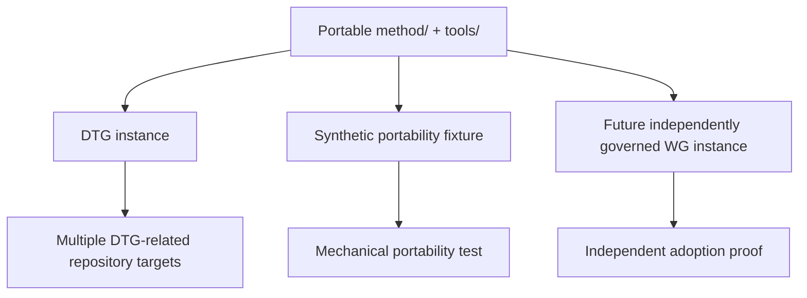

# Portability and independent adoption

RAHP v0.5 development distinguishes two different claims that were previously easy
to conflate.

## 1. Repository-target portability — already demonstrated

The RAHP engine already pressure-tests and monitors multiple configured repositories
through corpora, source provenance, drift detection, security review and combined
review modes. This demonstrates that one RAHP engine can operate across different
target specifications.

## 2. Independent-instance portability — the remaining proof

A stronger claim is that another Working Group can keep `method/` and `tools/`, supply
its **own** instance data, personas, risks, controls, governance profile and evidence
model, and use RAHP without inheriting DTG-specific assumptions.



## v0.5 portability fixture

`examples/portable-instance/` is deliberately synthetic. It contains an independent
minimal `data/` root and proves that the validator can operate without reading DTG
records or comparing the instance against the root DTG README.

Run:

```bash
python3 tools/validate_portability.py
```

Passing this test proves **mechanical portability only**. The v0.5 roadmap remains open
until a real external Working Group owns and governs a second instance.

## Portability contract

An adopter should be able to:

1. retain the portable `method/`, schemas and tooling;
2. provide a separate `data/instance.yaml`;
3. use its own record corpus and governance decisions;
4. validate that instance with `tools/validate.py --data <instance-data>`;
5. generate assessment evidence without importing DTG instance semantics; and
6. make an assessment-method claim using the portable conformance-claim template.

The distinction protects RAHP from claiming adoption merely because the engine can
read another repository.
