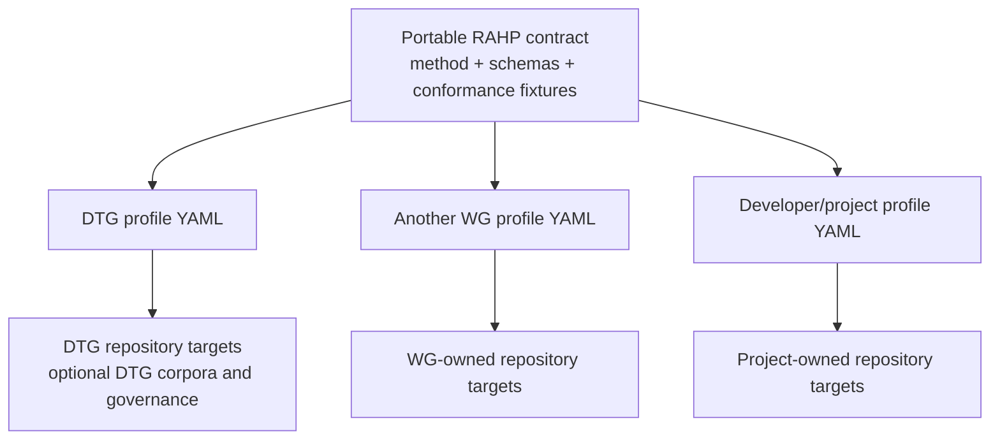

# Portability

RAHP is portable by construction: **the adopter supplies deployment configuration and owns deployment state; the method and engine contract remain shared**. v0.5 introduced the configuration boundary, v0.6 demonstrated it with DTG and CAWG/C2PA, v0.7 extended it to multi-source corpora and independent situational monitoring, and v0.8 makes the execution/result boundary language-neutral while separating ephemeral run state from durable assurance state.



## v0.5 portability contract

An adopter must be able to:

1. checkout RAHP without deleting or editing DTG exemplar material;
2. create one YAML file listing one or more repositories and their context;
3. validate the file against the portable RAHP configuration schema;
4. resolve target revisions with pinned commits, local Git checkouts, or configured remote branches;
5. select RAHP, security, or combined review mode per target;
6. scaffold assessment records without loading DTG corpora, DTG issues, DTG governance records, or the DTG Portfolio Monitor; and
7. retain full commit-level provenance for each assessment; and
8. keep ordinary execution exhaust outside Git while preserving compact durable dispositions and integrity-bound evidence references.

## Mechanical proof

`tests/fixtures/portable-project/rahp.yaml` is deliberately non-DTG. CI runs:

```bash
python3 tools/validate_portability.py
```

The fixture must validate, list its targets, and resolve dry-run scaffolding for all three review modes while containing no DTG repository, corpus, portfolio-monitor, governance-issue, or `RP-001` dependency.

Passing this test proves **configuration and workflow portability**. A real external Working Group adoption remains valuable field evidence, but it is no longer required to make the software architecture portable.

## Deployment-specific extensions

An adopter may add integrations under `extensions`. The bundled DTG profile uses this mechanism to describe its Portfolio Monitor relationship. The core schema intentionally treats extension content as adopter-owned metadata: the RAHP engine does not require it.

## Instance-local assurance vocabulary

A portable deployment may maintain risks or other assessment vocabulary that belongs to that instance rather than to the bundled DTG exemplar. The CAWG/C2PA deployment demonstrates this with `instances/cawg/data/risks.yaml`: its `CRK-*` identifiers are RAHP assessment artefacts and are not CAWG, DIF, or C2PA normative identifiers. The renderer and pressure-test validator resolve instance-local records without importing them into the portable method or the DTG catalogue.

## Independent change tracking

Portability also applies to operational monitoring. `tools/instance_monitor.py` reads a static deployment profile, tracks each `repository@branch` revision, records material changes, and emits review events. `tools/publish_assessment_issues.py` can turn those events into deduplicated issues in the RAHP review repository. This keeps source monitoring and review workflow reusable without coupling an external deployment to the DTG Portfolio Monitor. A discovered or configured GitHub repository with no commit history is represented as `status: no-commits` and does not abort the wider monitoring run; other HTTP/API failures remain errors so operational faults are not silently hidden.

`tools/issue_watch.py` provides an independent **allow-listed issue early-warning channel**. A deployment owns its issue registry, labels, state and affected-review mapping. The toolkit does not discover or ingest every issue automatically, and issue text never becomes normative evidence merely because it is watched. CAWG/C2PA and DTG both use this mechanism with separate registries, demonstrating that situational monitoring is part of the portable operational layer rather than a CAWG-specific feature.
