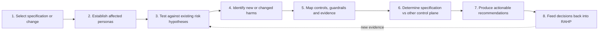

# Pressure-testing a specification

Specification pressure testing is a first-class RAHP workflow. The goal is to produce reproducible, traceable findings that can be re-run after a specification changes.




### Establish affected personas before scoring the finding

Use the portable `Pxx` roles first:

- `P1` Principal / Rights-Bearing Party
- `P2` Producer / Originating Actor
- `P3` Relying Party / Verifier
- `P4` Intermediary / Platform Operator
- `P5` Delegated Service / Agent Operator
- `P6` Registry / Discovery / Trust-Service Operator

Add `Mxx`, `Bxx`, or deployment-specific personas when machine behaviour, adversarial intent, lived experience, or local governance materially changes the finding. Persona references belong on the individual finding because different findings in the same specification can affect different actors.

A protocol role and a machine actor may both apply. For example, `P5` identifies the accountable remote-agent operator while `M1` identifies the benign machine agent performing the task.

See [Personas and actor roles](personas.md).


## Scenario-driven review pass

After establishing scope, select applicable scenarios from a domain corpus and map them to portable patterns in `method/scenario-patterns.yaml`. Exercise the target text under those conditions before finalising findings. Record relevant `scenarios`, `scenario_patterns`, and `personas` in each finding. This is especially useful for collusion, accessibility, degraded operation, policy transitions, delegation and cross-implementation ambiguity that may not be obvious from a clause-by-clause reading.

Validate corpus adapters with:

```bash
python3 tools/validate_scenario_corpora.py
```

See [Scenario-driven pressure testing](scenario-driven-pressure-testing.md) and [Scenario corpora](scenario-corpora.md).

## 1. Select the target

Record repository/document, version, commit or date, review scope and the authority expected to act on findings.

## 2. Establish affected personas and scenarios

Select the participants who exercise power, receive decisions, bear harms, or represent edge cases. Trace their likely scenarios before reviewing individual clauses in isolation.

## 3. Reuse existing risks first

Search the risk vocabulary owned by the deployment. The bundled DTG exemplar uses `data/risks.yaml`; an external deployment may use `instances/<id>/data/risks.yaml` instead. Add a new risk only when the applicable deployment vocabulary cannot represent the failure mechanism without distorting its meaning. Do not import another deployment's risk namespace merely to satisfy the validator.

## 4. Look for harmful inference and governance-invalid states

Ask what an implementation may infer beyond what was intended, what can remain cryptographically valid while authority is absent/revoked, and what assumptions collapse in adversarial or exceptional conditions.

## 5. Map controls and evidence

Connect each finding to relevant controls, guardrails, assurance tests and metrics. A recommendation with no plausible evidence path is difficult to assure.

## 6. Determine the control plane

Use the disposition model in [Governance boundaries](governance-boundaries.md). Do not force governance or runtime obligations into a technical specification merely because a risk is real.

## 7. Record the finding

Use this minimum record shape. The reusable starter file is `examples/pressure-test-template.yaml`:

```yaml
review:
  id: SR-001
  status: complete
  reviewed_on: YYYY-MM-DD
  target:
    repository: example-org/example-spec
    version: 1.2-draft
    commit: <full-40-character-commit-sha>
  reviewed_against:
    rahp_version: v0.9.0
  findings:
    - id: F-001
      title: Concise finding
      status: open
      severity: High
      primary_disposition: specification
      risks: [RISK-LOCAL-01]
      controls: []
      guardrails: []
      assurance_tests: []
      evidence:
        - source: spec/body.md#relevant-section
          observation: What the reviewed text permits, omits or contradicts.
      harm: Who can be harmed and how.
      recommendation: Action at the selected control plane.
      retest_when:
        - Observable condition that should trigger re-review.
```

A completed review is expected to pin the target to a full commit SHA and preserve enough evidence to explain why each canonical RAHP risk was triggered. During an ordinary run, the canonical working YAML lives under `.rahp/reviews/<slug>/`; a deliberately promoted exemplar uses `examples/<slug>/pressure-test.yaml`. Render and validate the record before promotion or durable disposition:

```bash
python3 tools/render_pressure_tests.py
python3 tools/validate_pressure_tests.py
```

For curated exemplars, the renderer updates only the region between `<!-- BEGIN GENERATED PRESSURE TEST -->` and `<!-- END GENERATED PRESSURE TEST -->`, preserving human-authored interpretation around it. It produces review metadata, scope, summary counts, a finding index, detailed RAHP mappings, evidence tables, harm statements, recommendations, related work, and retest triggers.

The validator checks target pinning, required finding metadata, controlled dispositions, summary counts, every referenced risk/control/guardrail/assurance-test identifier, and whether the generated README view is current. A YAML change without regeneration therefore fails validation rather than silently drifting from the human-readable report.

## 8. Re-run after change

A review is not complete when findings are published. Preserve the target version/commit and resolution references so a future revision can determine which findings are closed, reopened or made obsolete.

## Evidence produced

A pressure test should leave behind enough **durable assurance state** to answer: what was reviewed, against which RAHP version/engine contract, which risks were triggered, which target revision was assessed, what remains open, what change resolved a finding, what evidence supports the disposition, and when retesting is required. Raw logs and intermediate run artefacts are not durable evidence by default; see [Review evidence and retention](evidence-retention.md).


## Reference-link convention

`pressure-test.yaml` stores RAHP identifiers only. Authors should not maintain URLs in YAML. The renderer resolves each Risk, Control, Guardrail and Assurance Test against the applicable bundled or deployment-local catalogue and emits an **ID + title** Markdown link to `build/site/catalogue.html#<ID>`. The catalogue is generated from the same YAML corpus and assigns a stable HTML anchor to every catalogue artefact.

This creates a repository invariant: **a RAHP identifier in generated human-facing output should not be a dead identifier**. A reader should be able to follow the citation and immediately see its title, scope/description, relevant metadata and related artefacts. Run `python3 tools/validate_reference_links.py` after `tools/build.py` to verify the catalogue anchors and pressure-test links.

## Worked examples

Worked reviews are deliberately promoted `exemplar` artefacts and are maintained as regression fixtures for the method. The current set spans more than one deployment so the documentation does not imply that RAHP's semantics are DTG-specific:

- [`examples/cawg-c2pa/`](../examples/cawg-c2pa/README.md) is the external-deployment pack, expanded through v0.7 and revalidated with the v0.8 engine contract, with an independent `CRK-*` risk namespace.
- [`examples/dtg-credential-spec/`](../examples/dtg-credential-spec/README.md) pressure-tests a credential specification and demonstrates schema, lifecycle, privacy, governance, agent-authority and representation findings.
- [`examples/a2a/`](../examples/a2a/README.md) pressure-tests an agent interoperability protocol and demonstrates discovery-trust, multi-hop delegation, secondary-credential, callback and action-provenance findings.
- [`examples/trust-tasks-spec/`](../examples/trust-tasks-spec/README.md) pressure-tests a protocol/framework specification and demonstrates replay, freshness, delegation, registry-dependency, capability-negotiation, consent-policy and supported-representation findings.

The second example is intentionally important for method discipline: several findings are **not** recommendations to add another field to the core Trust Task envelope. They are routed to companion specifications, governance, runtime controls or operational policy because those are the narrowest effective control planes.

