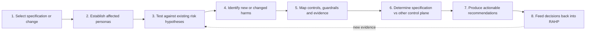

# Pressure-testing a specification

Specification pressure testing is a first-class RAHP workflow. The goal is to produce reproducible, traceable findings that can be re-run after a specification changes.



## 1. Select the target

Record repository/document, version, commit or date, review scope and the authority expected to act on findings.

## 2. Establish affected personas and scenarios

Select the participants who exercise power, receive decisions, bear harms, or represent edge cases. Trace their likely scenarios before reviewing individual clauses in isolation.

## 3. Reuse existing risks first

Search `data/risks.yaml` and linked scenarios/controls. Add a new risk only when the existing corpus cannot represent the failure mechanism without distorting its meaning.

## 4. Look for harmful inference and governance-invalid states

Ask what an implementation may infer beyond what was intended, what can remain cryptographically valid while authority is absent/revoked, and what assumptions collapse in adversarial or exceptional conditions.

## 5. Map controls and evidence

Connect each finding to relevant controls, guardrails, assurance tests and metrics. A recommendation with no plausible evidence path is difficult to assure.

## 6. Determine the control plane

Use the disposition model in [Governance boundaries](governance-boundaries.md). Do not force governance or runtime obligations into a technical specification merely because a risk is real.

## 7. Record the finding

Use this minimum record shape. The reusable starter file is `examples/pressure-test-template.yaml`:

```yaml
review:
  id: SR-001
  status: complete
  reviewed_on: YYYY-MM-DD
  target:
    repository: trustoverip/dtgwg-cred-spec
    version: Working Draft 01
    commit: <full-40-character-commit-sha>
  reviewed_against:
    rahp_version: v0.3-dev
  findings:
    - id: F-001
      title: Concise finding
      status: open
      severity: High
      primary_disposition: specification
      risks: [RK-SC02]
      controls: [CT-18]
      guardrails: [GR-01]
      assurance_tests: [AT-01]
      evidence:
        - source: spec/body.md#relevant-section
          observation: What the reviewed text permits, omits or contradicts.
      harm: Who can be harmed and how.
      recommendation: Action at the selected control plane.
      retest_when:
        - Observable condition that should trigger re-review.
```

A completed review is expected to pin the target to a full commit SHA and preserve enough evidence to explain why each canonical RAHP risk was triggered. The YAML review record is canonical. Render its human-readable view into the sibling README, then validate it:

```bash
python3 tools/render_pressure_tests.py
python3 tools/validate_pressure_tests.py
```

The renderer updates only the region between `<!-- BEGIN GENERATED PRESSURE TEST -->` and `<!-- END GENERATED PRESSURE TEST -->`, preserving human-authored interpretation around it. It produces review metadata, scope, summary counts, a finding index, detailed RAHP mappings, evidence tables, harm statements, recommendations, related work, and retest triggers.

The validator checks target pinning, required finding metadata, controlled dispositions, summary counts, every referenced risk/control/guardrail/assurance-test identifier, and whether the generated README view is current. A YAML change without regeneration therefore fails validation rather than silently drifting from the human-readable report.

## 8. Re-run after change

A review is not complete when findings are published. Preserve the target version/commit and resolution references so a future revision can determine which findings are closed, reopened or made obsolete.

## Evidence produced

A pressure test should leave behind enough evidence to answer: what was reviewed, against which RAHP version, which risks were triggered, which target version was assessed, what remains open, what change resolved a finding, and when retesting is required.

## Worked examples

Two complete reviews are maintained as regression fixtures for the method:

- [`examples/dtg-credential-spec/`](../examples/dtg-credential-spec/README.md) pressure-tests a credential specification and demonstrates schema, lifecycle, privacy, governance, agent-authority and representation findings.
- [`examples/trust-tasks-spec/`](../examples/trust-tasks-spec/README.md) pressure-tests a protocol/framework specification and demonstrates replay, freshness, delegation, registry-dependency, capability-negotiation, consent-policy and supported-representation findings.

The second example is intentionally important for method discipline: several findings are **not** recommendations to add another field to the core Trust Task envelope. They are routed to companion specifications, governance, runtime controls or operational policy because those are the narrowest effective control planes.

