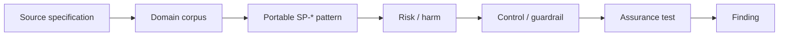
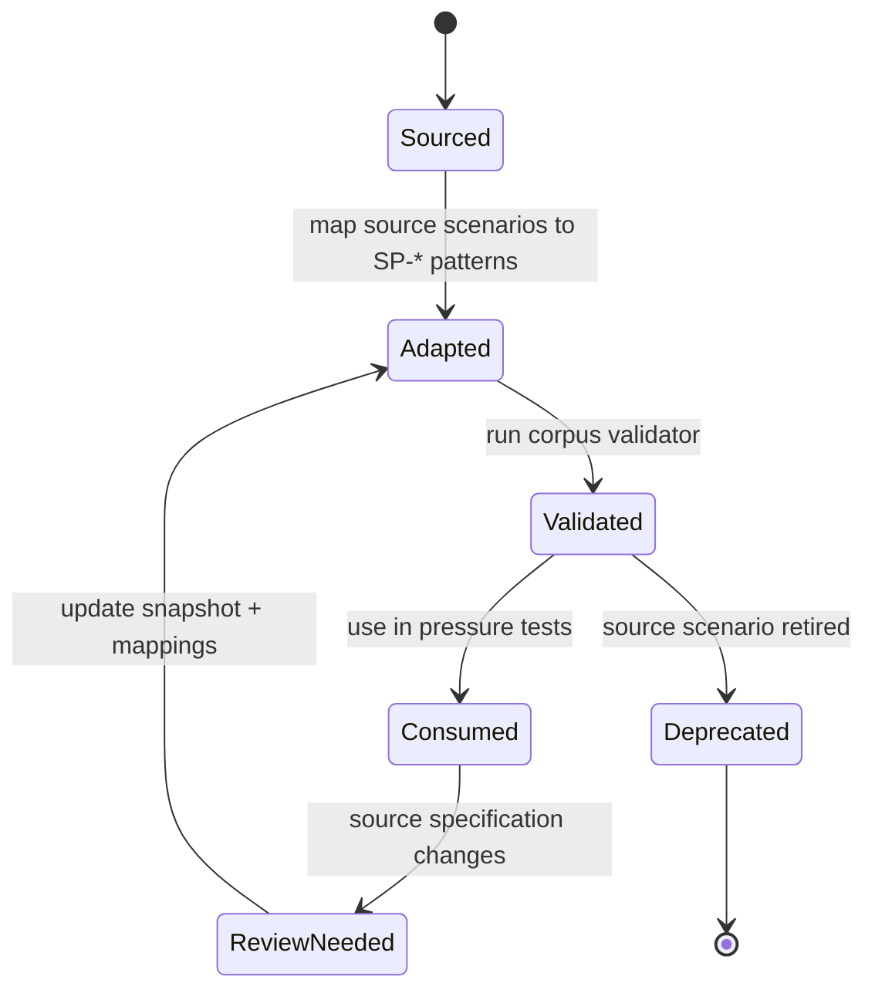

# Scenario corpora

Scenario corpora connect domain-specific use cases to portable RAHP pressure-test patterns. They are **adapters**, not normative forks: source projects retain authority over their own scenario meaning and identifiers.

## Available corpora

| Corpus | Source | Purpose | Scenario count |
|---|---|---|---:|
| [DTG ZKP](../corpora/dtg-zkp.yaml) | `sankarshanmukhopadhyay/dtgwg-zkp-tf` | ZKP implementation and governance stress cases | 30 |
| [Trust Tasks](../corpora/trust-tasks.yaml) | `trustoverip/dtgwg-trust-tasks-tf` | Task identity, proof, replay, transport, versioning, delegation and privacy | 16 |
| [DTG Credential Spec](../corpora/credential-spec.yaml) | `trustoverip/dtgwg-cred-spec` | Credential lifecycle, relationship semantics, privacy, authority and task context | 16 |
| [Trust Tasks × CredSpec](../corpora/trust-tasks-credspec-composed.yaml) | RAHP-authored cross-spec adapter | Emergent failure modes at the task/credential seam | 12 |
| [CAWG/C2PA](../corpora/cawg.yaml) | Multi-source external CAWG/C2PA portfolio | Identity, governance, consent, delegation, metadata, privacy, UX, security and mandate-readiness interactions | 36 |

Together these adapters expose **110 scenario test vectors** to the RAHP pressure-testing workflow. The CAWG/C2PA corpus is intentionally multi-source: its primary source and additional specification repositories are declared without inventing a DTG Portfolio Monitor relationship.

## Why separate corpora from patterns?

A source scenario such as `TT-002` or `CS-007` describes a concrete domain condition. A portable `SP-*` pattern describes the reusable failure class. This separation lets RAHP ask the same harms question across specifications without taking ownership of another project's identifiers.

## Trust Tasks corpus

The Trust Tasks adapter is grounded in the current framework text and covers, among other things:

- proof omission and transport/security boundaries;
- audience binding and cross-recipient replay;
- in-band versus transport-derived identity;
- expiry and retry semantics;
- thread and ceremony composition;
- bearer task semantics;
- capability-discovery privacy;
- framework/version migration;
- transport-binding downgrade;
- error-channel leakage;
- resource-exhaustion paths;
- delegated-agent intent drift and exposure classification.

## Credential Spec corpus

The Credential Spec adapter focuses on:

- completeness and directionality of relationship edges;
- pairwise identifier reuse and correlation;
- selective-disclosure metadata leakage;
- issuer authority and registry status changes;
- unavailable status/governance dependencies;
- VC v1.1/v2.0 migration;
- `taskContext` overclaim and outcome-evidence availability;
- witness-to-edge binding;
- invitation replay;
- personhood assurance interpretation;
- proof-suite agility;
- holder/controller compromise;
- accessibility and cross-community recognition.

## Cross-spec composed corpus

Some of the most consequential failures are not owned by either specification alone. The composed corpus therefore tests conditions such as:

- credential authority changing between task authorization and execution;
- replaying a task with a still-valid credential;
- task party identity being conflated with credential roles;
- bearer task semantics broadening credential disclosure;
- two minimal credentials becoming identifying when composed;
- an agent continuing to use a credential after human intent changes;
- offline task processing against stale credential or registry state;
- asymmetric version migration;
- responsibility fragmentation during appeal or redress.

The `XSP-*` identifiers are RAHP-owned because these are deliberately synthesized interaction scenarios rather than copied source use cases.

## CAWG/C2PA corpus

The v0.7 CAWG/C2PA adapter contributes 36 RAHP-owned scenario vectors across identity and authority, trust registries/TRQP, consent and rights, delegation and agents, metadata composition, privacy, UX, credential mechanisms, historical verification and mandate exclusion. These scenario IDs are assessment artefacts rather than upstream CAWG identifiers. They are used by the experimental-branch and cross-specification pressure tests to make composition failures reproducible.

## Corpus lifecycle

A corpus adapter has its own maintenance lifecycle even though scenario ownership stays with the source project.

The adapter version and source snapshot make that lifecycle visible without transferring ownership of source identifiers into RAHP. See [Corpus synchronization and provenance](corpus-synchronization.md) for the automated drift-detection and review model.

## Adding another corpus

1. Keep source-owned identifiers and normative meaning with the source project.
2. Add a YAML adapter under `corpora/`.
3. Register the adapter in `corpora/sources.yaml`, including its tracked repository/path. Add portfolio metadata only when that deployment actually has a portfolio registry; multi-source adapters may declare `additional_repositories`.
4. Record an immutable reviewed source commit and adapter version; never advance a source pin merely because upstream HEAD changed.
5. Give every scenario a domain, goal, pressure, priority and at least one `SP-*` mapping.
6. Prefer a `source_anchor` that tells a reviewer where the scenario was derived.
7. Run `python3 tools/validate_scenario_corpora.py` and `python3 tools/corpus_status.py --offline`.
8. Use scenario IDs and pattern IDs in pressure-test findings only when they materially contributed to the finding.
9. Re-run affected reviews when the upstream semantics change.

{: .warning }
A corpus broadens review coverage; it does not establish that the target specification is safe or conformant.
