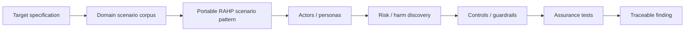

# Scenario-driven pressure testing

RAHP can test a target specification against **concrete operating conditions**, not only inspect normative text. A scenario is a test vector that introduces actors, failure conditions, adversaries, governance changes or environmental constraints and asks whether the specification still produces an acceptable outcome.

## Model

The portable scenario patterns live in [`method/scenario-patterns.yaml`](../method/scenario-patterns.yaml). Domain adapters live under [`corpora/`](../corpora/). Domain IDs are **not** promoted into the RAHP canonical namespace; ownership remains with the source specification or project.

## Finding traceability

Pressure-test findings may now carry three optional fields:

- `scenarios`: domain scenario IDs that exercised the finding;
- `scenario_patterns`: portable RAHP pattern IDs that explain the reusable failure class;
- `personas`: affected or adversarial RAHP persona IDs where a canonical mapping exists.

This produces a review chain of **scenario → pattern → persona → risk → control/guardrail → assurance test → recommendation**.

## Composition

A reviewer should not assume that scenarios are independent. Useful pressure tests deliberately compose them, for example:

- delegated agent + policy change + authority suspension + registry unavailable;
- shared device + malicious verifier + offline presentation;
- low-end device + accessibility constraint + mandatory step-up proof.

Composition is where otherwise reasonable controls often expose emergent harms or ambiguous governance.

## Coverage

Scenario coverage is evidence about review breadth, not proof of safety. A review should record which scenario classes were exercised and identify materially relevant classes that were not tested.
