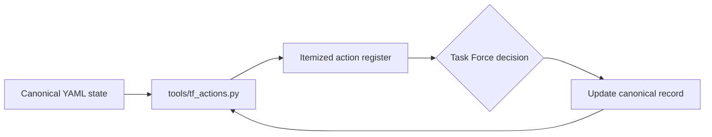

# Task Force action register

RAHP deliberately separates **mechanism** from **governance decisions**. The repository
can generate candidate analysis, validation results, monitoring contracts, and decision
support without silently deciding what the Task Force has not ratified.

The current itemized queue is generated from canonical record state:

**[Open the generated Task Force Action Register](../build/site/task-force-actions.html).**

## What appears in the register

An item is automatically surfaced when:

- a control or guardrail has `standards_status: unassigned`;
- a rule profile such as `RP-001` remains `proposed`;
- a governance precedent remains `proposed`;
- a risk acceptance remains `pending`; or
- an operational monitoring contract remains `pilot_proposed`.

This means the well-known **87 normative-triage decisions are not one opaque backlog
item**. Every `CT-*` and `GR-*` decision appears separately with its source record,
current state and required decision.

## How the register stays current



The register is derived by `tools/build.py` and committed under `build/`. It must not
be edited by hand. Once a decision changes canonical state, its action either disappears
or changes on the next build.

Run:

```bash
python3 tools/tf_actions.py
python3 tools/build.py
```

## Accountability boundary

The generated register can identify and organize decisions. It cannot ratify them.
Meeting minutes, GitHub decisions, resolutions, or other accountable governance evidence
should be linked from the canonical record when the Task Force acts.
