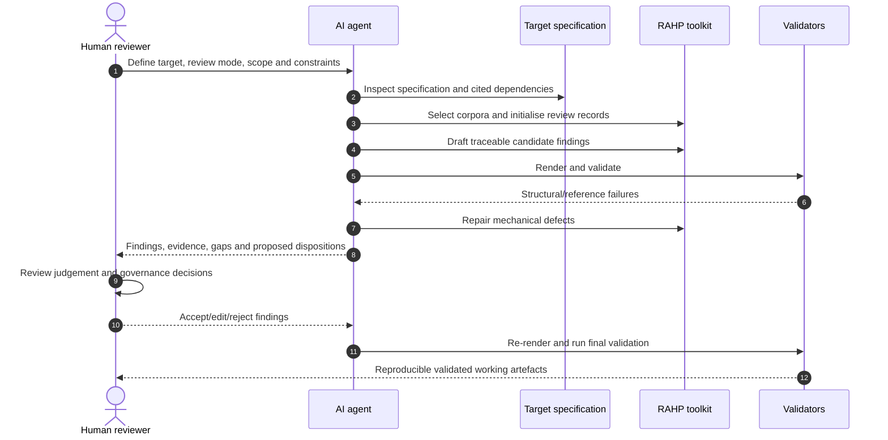
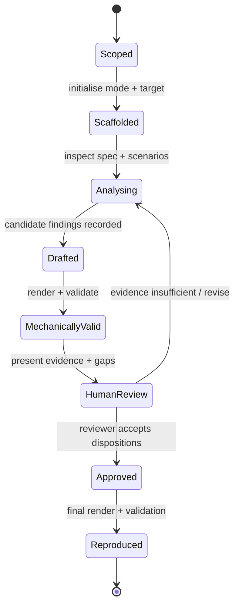
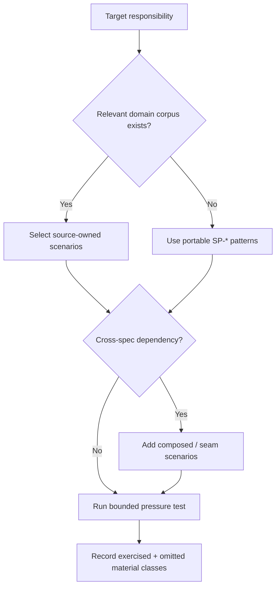

# Use an AI agent to run a pressure test

An AI agent can do much of the **review orchestration and evidence preparation** around RAHP. It can inspect a specification, select relevant scenario corpora, scaffold a review, propose traceable findings, run the validators, and render a report. It should not silently become the accountable risk owner, evidence authority, or governance decision-maker.

{: .decision }
The useful operating model is **agent-assisted, human-accountable**: the agent performs repeatable analysis and repository operations; a reviewer accepts, rejects, edits, and dispositions findings.

## What the agent can do

A capable coding or repository agent can:

1. clone or open this RAHP repository and the target specification;
2. identify the appropriate review mode: `rahp`, `security`, or `combined`;
3. inspect the available scenario corpora and choose relevant test vectors;
4. run `tools/review.py init` to create an ignored working review under `.rahp/`;
5. read the target specification and populate evidence-backed candidate findings;
6. link findings to RAHP risks, controls, guardrails, assurance tests, scenarios, patterns, and personas;
7. render the human-readable reports;
8. run all validators and repair structural/reference errors;
9. present the resulting diff and unresolved judgement calls to a human reviewer.

It should **not** fabricate evidence, assign final risk acceptance, claim an assurance test passed without evidence, or make governance decisions on behalf of the accountable group.

## Agent workflow



The swimlane makes the accountability boundary explicit: **the agent may prepare the decision surface; the human owns the decision**.

## Minimal prompt contract

Give the agent a bounded instruction with five things:

- **Target:** repository/path/version or commit being reviewed.
- **Mode:** `rahp`, `security`, or `combined`.
- **Scenario scope:** one or more corpora, or permission to select relevant scenarios and explain why.
- **Evidence rule:** every substantive finding must cite target text or an observable repository fact; uncertainty must be stated.
- **Authority boundary:** do not assign final risk scores, accept risks, or claim assurance tests pass without reviewer-supplied evidence.

A practical instruction is:

```text
Use this RAHP checkout to pressure-test <target repository/path> at <commit>.
Run a combined review. Select materially relevant scenarios from the available
corpora and explain the selection. Populate only findings that can be traced to
specific target text or repository evidence. Link each finding to applicable
RAHP risks/controls/guardrails/tests and scenario IDs where justified.

Do not invent evidence, finalise risk acceptance, or mark assurance tests as
passed without evidence. Render and validate the review, fix mechanical errors,
and then give me: (1) the candidate findings, (2) unresolved judgement calls,
(3) coverage gaps, and (4) the exact files changed for human review.
```

## Command path the agent should use

For a combined review:

```bash
python3 tools/review.py init \
  --mode combined \
  --slug example-spec \
  --title "Example Specification" \
  --repository owner/repo \
  --version "Draft 0.1" \
  --commit <40-character-sha>
```

After evidence-backed findings are added:

```bash
python3 tools/review.py run --mode combined
python3 tools/validate.py
python3 tools/validate_scenario_corpora.py
python3 tools/validate_pressure_tests.py
python3 tools/validate_security_reviews.py
python3 tools/validate_combined_reviews.py
python3 tools/validate_reference_links.py
```

## State model for an agent-run review



A review is **not complete merely because YAML validates**. Mechanical validity means the artefacts are internally coherent; human review determines whether the analysis is defensible.

## How to choose scenario corpora

The agent should start from [Scenario corpora](scenario-corpora.md) and map the target's actual responsibilities to corpus pressure. It should not run all scenarios indiscriminately merely to maximise a coverage number.

A useful selection rule is:



## Evidence and citation discipline

For every candidate finding, the agent should distinguish:

- **observed evidence** — target text, schema, test, workflow, issue, or repository fact;
- **inference** — what the evidence may imply under a scenario;
- **RAHP mapping** — why a canonical risk/control/guardrail/test applies;
- **recommendation** — a proposed change, not a fact about the target.

If the agent cannot separate those four, the finding is not ready for reviewer consideration.

## Human checkpoints

Human review is mandatory before:

| Checkpoint | Why it cannot be delegated silently |
|---|---|
| Risk severity/likelihood | Depends on deployment context and accountable judgement. |
| Risk acceptance | Creates a governance decision and ownership obligation. |
| Assurance-test pass/fail | Requires actual evidence about an implementation or process. |
| Persona/community representation | Requires lived-context and participation, not model inference alone. |
| Normative recommendation | May change implementer obligations and interoperability. |
| Final publication | The reviewer must stand behind the review record. |


## Storage and promotion

The agent should treat `.rahp/` as disposable working state. A successful render or validation does **not** by itself justify committing the run. After accountable review, either:

- promote the review into `examples/` when it is intentionally maintained as a teaching/conformance exemplar; or
- preserve a compact deployment disposition and evidence manifest under `instances/<id>/reviews/`, leaving large or sensitive evidence in deployment-controlled storage.

See [Review evidence and retention](evidence-retention.md).

## Use an agent to maintain a corpus

The same accountability model applies when related repositories evolve. Start with `python3 tools/corpus_status.py` or the scheduled **Corpus source status** workflow. When a corpus is flagged, generate a bounded review packet:

```bash
python3 tools/corpus_review.py CORPUS-DTG-CREDSPEC --output build/corpus-review.md
```

The agent may compare the reviewed source pin with the observed HEAD, inspect changed tracked paths, identify scenarios or `SP-*` mappings that may need revision, and propose cited edits. It must not silently advance `source_commit`. The immutable pin is advanced only after a human confirms that the adapter accurately represents the reviewed source state. See [Corpus synchronization and provenance](corpus-synchronization.md).

## Agent-friendly repository contract

An agent does not need a proprietary integration. It needs filesystem access, a shell/Python runtime, and read access to the target material. The repository deliberately exposes stable commands, structured YAML, scenario adapters, canonical IDs, generated Markdown, and validators so that coding agents, CI agents, or local personal agents can use the same workflow.

For the three review modes and output locations, see [Review modes](review-modes.md). For scenario selection, see [Scenario-driven pressure testing](scenario-driven-pressure-testing.md). For interpretation and governance, see [Interpreting results](interpreting-results.md) and [Governance boundaries](governance-boundaries.md).

## Agent systems being reviewed

This guide explains how an AI agent can assist the **RAHP review process**. If the target
specification itself governs non-human agents or delegated execution, also use
[Agent delegation governance](agent-delegation-governance.md). RAHP v0.4 deliberately
keeps reviewer-agent permissions separate from the delegated authority being analysed.
