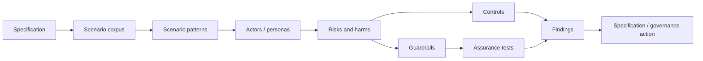

# RAHP Toolkit

RAHP is a reusable **Risk Assessment & Harms Prevention** method for pressure-testing standards against human harms, security failures, governance weaknesses and operational edge conditions.

{: .decision }
RAHP now supports **scenario-driven pressure testing**: a specification can be tested against reusable scenario patterns and domain-specific scenario corpora, not only reviewed as static text.

## Start here

- [How RAHP works](docs/how-rahp-works.md)
- [Pressure-testing a specification](docs/pressure-testing-a-spec.md)
- [Scenario-driven pressure testing](docs/scenario-driven-pressure-testing.md)
- [Scenario corpora](docs/scenario-corpora.md)
- [Review modes](docs/review-modes.md)
- [Use an AI agent to run a pressure test](docs/using-an-ai-agent.md)
- [Security-hardening review](docs/security-hardening-review.md)
- [Adoption guide](ADOPTION.md)
- [Quick start](QUICKSTART.md)
- [CAWG/C2PA external instance](docs/cawg-instance.md)
- [CAWG/C2PA worked pressure tests](examples/cawg-c2pa/README.md)
- [GitHub Pages coverage](docs/pages-coverage.md)

## Assurance chain

## Reference implementation

The bundled DTG scenario corpora remain reference adapters. v0.6 additionally provides the first substantial **external deployment proof**: CAWG/C2PA specifications are configured through the same portable engine, independently pressure-tested, and monitored for material upstream changes without inheriting DTG portfolio or governance state.
