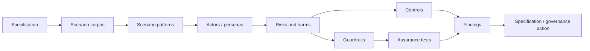

# DTG RAHP Toolkit

RAHP is a reusable **Risk Assessment & Harms Prevention** method for pressure-testing standards against human harms, security failures, governance weaknesses and operational edge conditions.

{: .decision }
RAHP now supports **scenario-driven pressure testing**: a specification can be tested against reusable scenario patterns and domain-specific scenario corpora, not only reviewed as static text.

## Start here

- [How RAHP works](docs/how-rahp-works.md)
- [Pressure-testing a specification](docs/pressure-testing-a-spec.md)
- [Scenario-driven pressure testing](docs/scenario-driven-pressure-testing.md)
- [Scenario corpora](docs/scenario-corpora.md)
- [Review modes](docs/review-modes.md)
- [Use an AI agent to run a pressure test](docs/using-an-ai-agent.md)
- [Security-hardening review](docs/security-hardening-review.md)
- [Adoption guide](ADOPTION.md)
- [Quick start](QUICKSTART.md)
- [GitHub Pages coverage](docs/pages-coverage.md)

## Assurance chain

## Reference implementation

The first external scenario corpus is derived from the **DTG ZKP implementation-guide pressure-test corpus**, providing 30 scenarios across privacy, liveness, holder binding, governance, lifecycle, accessibility, agent delegation, offline operation, resilience, crypto agility and interoperability.

The corpus remains domain-owned by the ZKP work. RAHP consumes a structured adapter and maps each domain scenario to portable RAHP scenario patterns.
